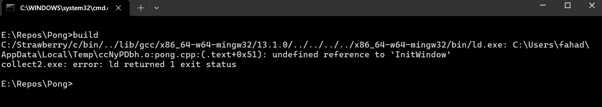

This is the setup section of this tutorial. It's really much simpler than you'd expect, but if you'd like to skip this section, ready versions of the final set-up will be provided for Windows and MacOS.

## Making the Build System

To get started, let's make a folder called "Pong", and create a file in it called "pong.cpp". The ".cpp" file extension stands for C++.


Inside the file we'll just put a hello world program for now.

```cpp
#include <iostream>

int main()
{
    std::cout << "Hello World\n";
    return 0;
}
```

One way to actually run this code is to use the standard C/C++ VSCode extension, in this tutorial however, we'll be invoking the compiler directly in the command-line. Make sure you have the GCC compiler installed on your device, and in your path (resources will be provided for this later). Open CMD (or whichever terminal you prefer), go to the folder we just created, and write `g++ pong.cpp -o pong.exe`.


This will invoke the G++ compiler, compile the file `pong.cpp` and link it into the output executable `pong.exe`. There should now be a `pong.exe` file in our new folder.


If you run it from the CMD by just typing `pong.exe`, it will run our Hello World program.


Having to write out the compile command everytime we want to compile is tiresome though, so instead of doing that we will write a shell script that will just execute the command for us. In our new folder, let's create a file called `build.bat`.


This is the file that contains our compile command, for now let's just put the command we used earlier on it.

```batch
g++ pong.cpp -o pong.exe
```

If we just call this script now in our terminal, it will automatically type out the command written inside it.


The second line is typed out automatically. If you don't want for it to be visible however, just type out a `@` in the beginning of the line where your command is.

```batch
@g++ pong.cpp -o pong.exe
```

Now, it should just execute the compile command without echoing it in the terminal.


To verify that it's working, let's add a message in our program, build it, then run it to check that it is indeed working correctly.

```cpp
    std::cout << "Hello World\n";
    std::cout << "This is our first game in GDG!\n";
```

Let's save it and check.


Now let's setup Raylib for this project. The process is as simple as adding a couple of flags to our `build.bat` file, and copying a few files to our Pong folder.

## Setting up Raylib

In order to setup Raylib, there are really only 2 things we need to do:

- Add a header folder and file, and include them in the compile command

- Add the actual library itself and link it in the compile command

In total, they're just 2 files, 1 library and 1 header. There will be a link to download these files. Just copy them in your folder like so:


Now, let's update our build script to account for these inclusions.

```batch
@g++ pong.cpp -o pong.exe -I include
```

Now, if we update our main source file to include `raylib.h`, it should work fine once we compile it.

```cpp
#include <iostream>
#include <raylib.h>
```

Let's compile.


Great! There are no errors. Here's what we would've got if we didn't put `-I include` in our build file:


The `-I include` command basically tells the compiler to search within the provided directory for header files, in this case it's searching through our "include" folder to find `raylib.h`.

Now, let's try to actually call a method found in `raylib.h` in our file. Let's use the most simple method, `InitWindow()`. As you might expect, this is just a function that creates a window for our game. It takes in three parameters: `width`, `height`, and `title`. For our purposes, we'll make our game a fixed 1280x720 and call it *"pong"*.

```cpp
    std::cout << "Hello World\n";
    std::cout << "This is our first game in GDG!\n";
    InitWindow(1280, 720, "Pong");
```

If we try to run the code now however, we'll get some strange errors:



This is GNU's idea of a linker error. It's long and protracted but basically, what it's trying to tell is us is that the `InitWindow()` function we're trying to call doesn't actually have an implementation available to it that it can execute. G++ knows the function exists because it's found in `raylib.h`, but it doesn't know what it actually does because the header file doesn't contain the implementation for the function. Instead, the implementation is available to us in the "lib" folder we downloaded from earlier.


In here we'll find this `libraylib.a` file.


This file contains the implementations of *all* the functions found in `raylib.h`, what we need to do now is to link it in our compile command:

```batch
@g++ pong.cpp -o pong.exe -I include -L lib -l raylib
```

The `-L lib` flag is similar to the `-I` one, it tells the compiler the directory to search through when looking for libraries to link, in this case it's the "lib" directory. The `-l raylib` flag tells the compiler to link the `libraylib.a` file inside the lib folder from earlier, the first 3 letters "lib" and the file extension ".a" are not included when invoking this flag for some reason (GNU is weird).

Let's try running it now:


Woah! Now that is a *lot* of linker errors. Don't fret though. All of these linker errors is because we didn't link the libraries of the actual *operating system* yet. You see, `InitWindow()` creates a window for our game to run in, in order for it to do that though, it needs to work with the operating system for it to actually get that window. In our case, the operating system is Windows, and there are actually a few Windows libraries we need to link before we can say that all the necessary libraries are linked to our program. So let's go ahead and include them.

```batch
@g++ pong.cpp -o pong.exe -I include -L lib -l raylib -l gdi32 -l opengl32 -l winmm
```

Now that's quite a lot of libraries. You don't need to know the details, but if you're curious, the libraries we linked are:

- `gdi32`: The Windows Graphics Device Interface, for creating our window

- `opengl32`: The Open Graphics Library, for rendering our graphics

- `winmm`: The Windows MultiMedia API, for audio stuff

Now, if we try to build, it should work just fine.


It works! However, if we try running it, something odd happens.


A bunch of Raylib Info lines show up, and a window momentarily appears and disappears, why does this happen? It's because after we Initialize our Window, there's nothing else left for the program to do, so it just shuts down.

Don't worry about that for now. Right now, we've completed the setup section! Now we can move on to actually programming the game.
