# 2. The Game Loop

In the previous section of this tutorial, we setup our projects dependencies and build "system". Now, we'll actually get to programming the game itself, starting with the game loop.

## The Game Loop

In our earlier sections, we discussed the basic idea of the game loop. Now we get to see what that looks like in code. Once we remove our `std::cout` lines, this is what our code looks like now:

```cpp
#include <iostream>
#include <raylib.h>

int main()
{
    InitWindow(1280, 720, "Pong");
    return 0;
}
```

We can see that after the `InitWindow` call, there's no other code to execute, and the program returns. In order to stop this and actually have a program running, we need to create a loop. Theoretically, a `while (true)` loop could suffice, however in Raylib, there's a function called `WindowShouldClose()` that returns a boolean. We'll use this boolean as the condition for our loop instead, such that if the return value is `false`, then we know that nothing has been done to make the window close, and our program should continue executing.

```cpp
    InitWindow(1280, 720, "Pong");

    while (!WindowShouldClose())
    {
    }
```

The difference between this approach and the `while (true)` one is that for this one, certain events can take place that will actually effect the condition. For example, if we press the big red "**X**" on the top right corner of the window, this variable will switch to true, and our program will close. Another condition that will by default effect this variable is if we press the escape key. Pressing escape will shutdown our program by default.

If we try to run it now, we get a window! However, it's unresponsive.

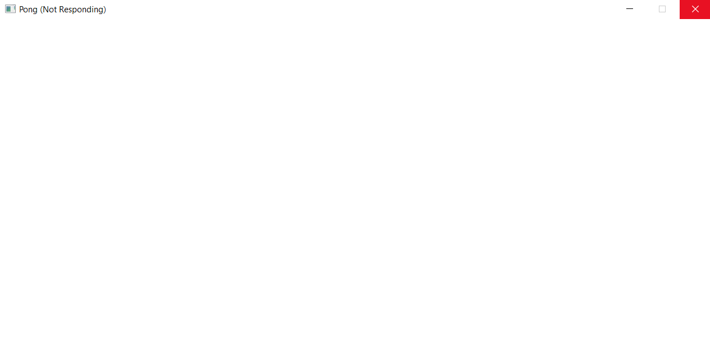

The reason for this is that throughout the loop that's repeating itself, our program is not interacting with the operating system at all. Raylib provides functions that do this directly, such as `PollInputEvents()`, this is for advanced users however. In Raylib, the polling of OS events happens in tandem with the rendering functions, so if we just create a simple rendering loop this problem will resolve itself just fine.

## Rendering Graphics

The graphics functions mostly operate in their own "phase" of sorts. The beginning and end of this phase are marked by the `BeginDrawing()` and `EndDrawing()` functions. If we place them in order in our loop, our program will become responsive.

```cpp
    while (!WindowShouldClose())
    {
        BeginDrawing();
        // All of our graphics stuff happens here!
        EndDrawing();
    }
```

If we run it now, we'll get this:

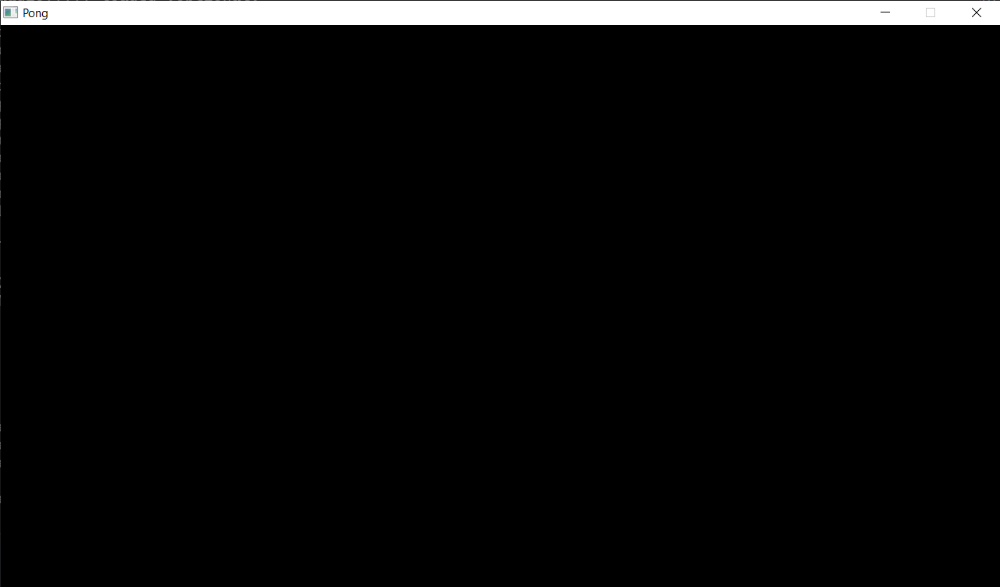

We finally have a fully working, proper, honest window on our hands. We can move it around, minimize it, and even close it. One thing we can't do yet is resize it, but that's intentional, to make the process of actually making our game simpler.

Let's try actually drawing something on the screen for real this time. In Raylib, there's a function called `DrawRectangle()` that takes in 5 arguments. `posX, posY, width, height, color`. In both Raylib and Godot, the origin of a rectangle is the top-left corner, and the rectangle expands rightwards and downwards according to the width and height.

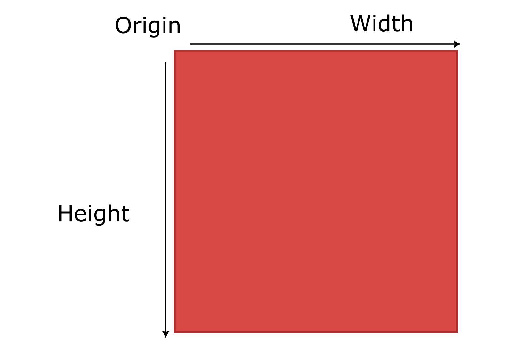

So, in our code, let's just a draw a red square with the origin points (0, 0) and a 40x40 size.

```cpp
    while (!WindowShouldClose())
    {
        BeginDrawing();
        DrawRectangle(0, 0, 40, 40, RED);
        EndDrawing();
    }
```

If we run it now, we'll see a red square at the top left corner of our screen:

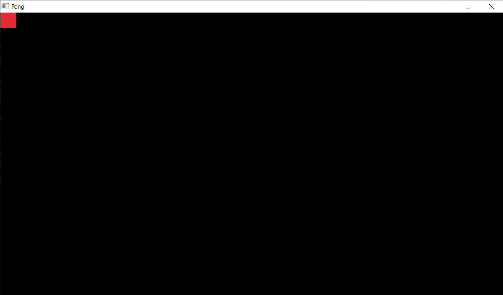

The reason the square is showing up on the top left corner of the screen is because right now, the origin of the coordinate system is mapped to the top-left corner. This would be a good time to talk about coordinate systems.

## Coordinate Systems

Maths are a very common element of video game programming that you need to intuitively understand if you want to confidently develop your ideas into games. The maths required in game development is not that difficult or complicated, and in general you'll find you'll get better at it the more you do it.

The first thing you should understand is coordinate systems. You might be familiar with this setup: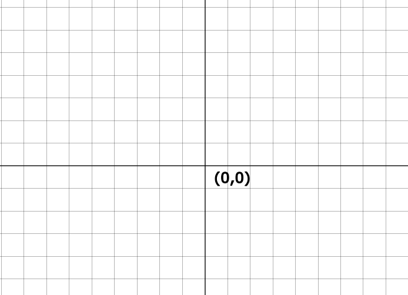

You should all be familiar with this from high school. You have an X-axis and a Y-axis. The grid here represents all the points that you can represent in two-dimensions. Each square being one unit, right is positive on the X-axis, left is negative... basically no different from when you remember it.

Well, no. Actually there is one difference between the systems in Raylib and Godot and from the coordinate systems you're all familiar with. In Raylib and Godot, up is **negative** on the Y-axis, and down is positive. So if we filled out the numbers it would look something like this.

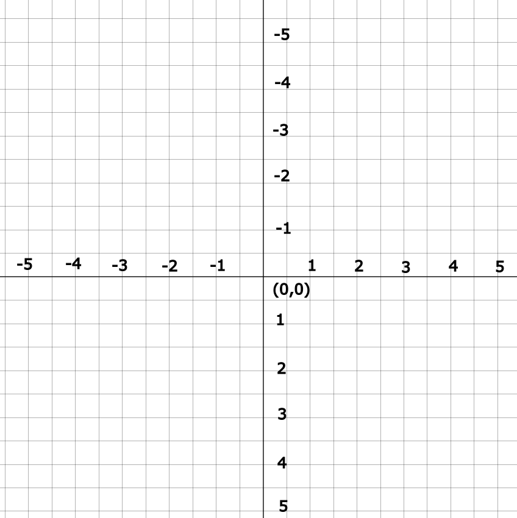Moreover, the origin point (0, 0) is in the center. But in our current setup (in-game), the origin point is in the top left, and the width and height of the grid correspond to the screen width and height that we set. In other words, each unit in the grid is 1 pixel.

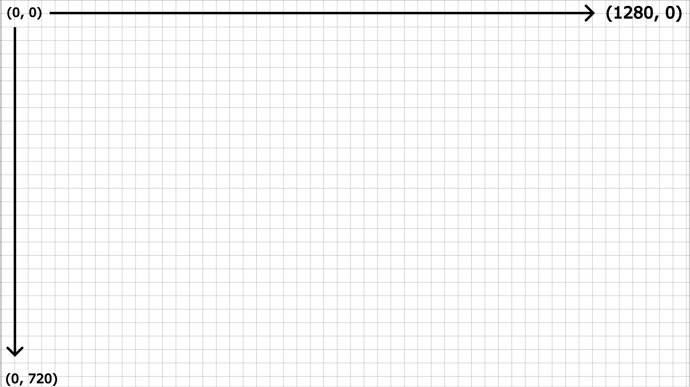

In this illustration, each grid square is obviously not one pixel because it's not scaled correctly, but this is just an example. When you look at it, and keeping in mind that rectangle coordinate systems follow the same pattern of having the origin at the top-left, it becomes clear why our call to the `DrawRectangle()` function caused it to appear where it did. (0, 0) is the top-left, and the square itself is goes 40 pixels to the right and 40 pixels down from the origin. If we stretched the **width** to 1280, same as the screen width, then it will appear as a big red strip on covering the top-most part of our screen.

```cpp
        DrawRectangle(0, 0, 1280, 40, RED);
```

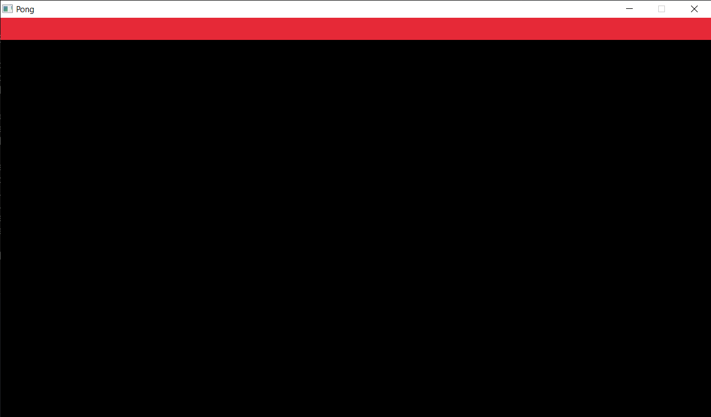

Same with the height.

```cpp
        DrawRectangle(0, 0, 40, 720, RED);
```

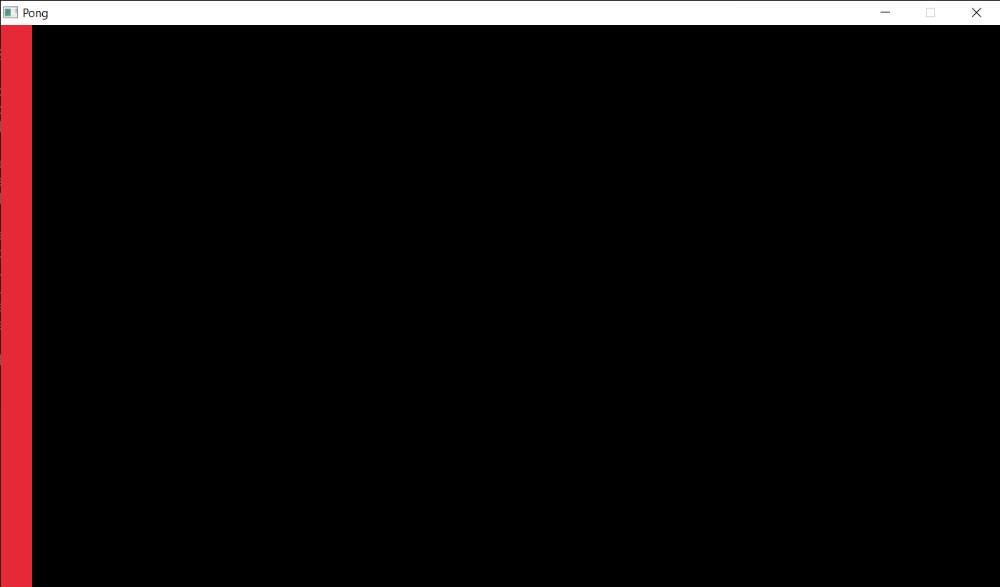

Let's try placing the square right in the center of our screen. We know the right side is 1280, and the left side is 0, so logically the middle is between those two points , ${(0+1280)\over{2}}=640$. Likewise with the height, ${(0+720)\over{2}}=360$. So lets try placing our 40x40 square there.

```cpp
        DrawRectangle(640, 360, 40, 40, RED);
```

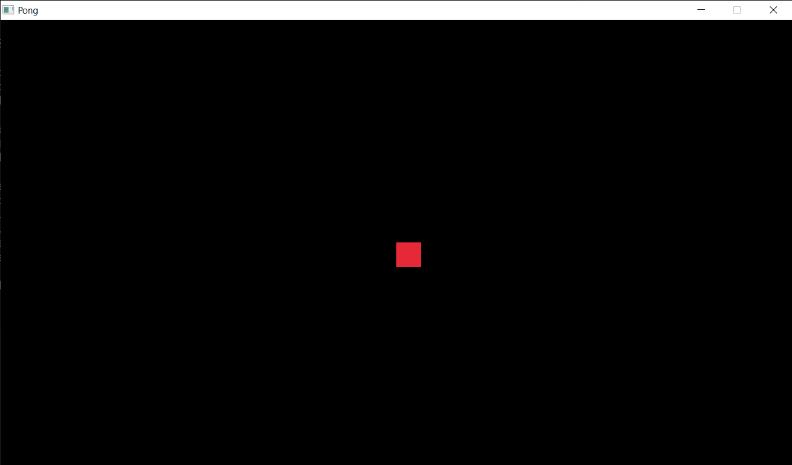

And there it is! You'll notice that it's not *exactly* in the center, rather, the *top-left corner* of the square is in the center. If we want the center of the square to be in the center of the screen we'd have to displace it up and to the left 20 units. But that's not necessary, what's important now is that you understand this concept of the coordinate system because it'll be really important for your game development journey.

## Moving the Square

Having a square appear where we want it to be is cool and all, but it'd be nicer if we could actually move the square. Moving the square is really as simple as just moving the position of the square `posX, posY`. But how do we actually do that? Well first, we must take input from the user.

Raylib has several functions for receiving input from the user, but the ones we're interested in right now are `IsKeyPressed()` `IsKeyDown()` and `IsKeyReleased()`. Each of these functions takes in a keycode as an argument, and returns a boolean.

- `IsKeyPressed()` returns true if the key was *just* pressed at that moment.

- `IsKeyDown()` returns true if the key is held down at *any* moment.

- `IsKeyReleased()`returns true if the key was *just* released at that moment.

!!! note

    In Godot — the engine we'll be using — the functions for checking input are mostly the same; there are distinctions between having *just* pressed a key, *holding* a key down, and having *just* released a key.

Let's write something simple for now, let's make a program that changes the color of our square to green if the user pressed the space bar:

```cpp
    Color square_color = RED;

    while (!WindowShouldClose())
    {
        if (IsKeyPressed(KEY_SPACE))
        {
            square_color = GREEN;
        }

        BeginDrawing();
        DrawRectangle(640, 360, 40, 40, square_color);
        EndDrawing();
    }
```

If we run the program now, the color of the square will be initially red:

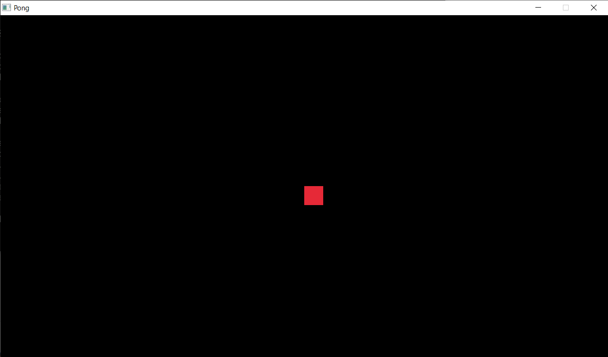

But if we press space...

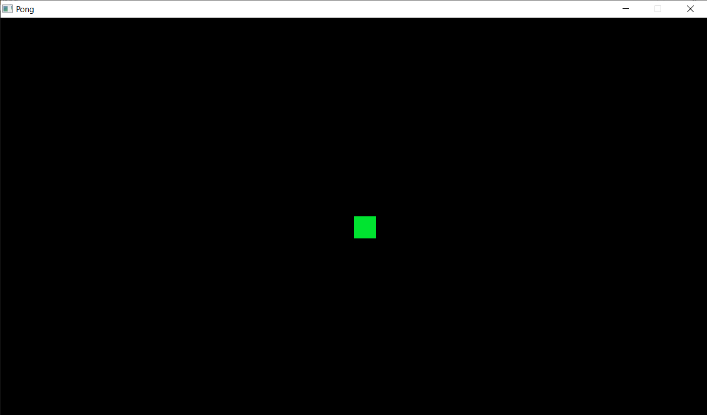

It turns green! This is the first example you'll see of non-graphics state being rendered in visual form. The `square_color` variable is affected by user input, and it's also used in the drawing phase of our program. If we want our square to move according to user input, we need to do something similar but this time with the player's position.

```cpp
    Vector2 player_position = { 640, 360 };

    while (!WindowShouldClose())
    {
        if (IsKeyPressed(KEY_RIGHT))
        {
            player_position.x += 40;
        }

        BeginDrawing();
        DrawRectangle(player_position.x, player_position.y, 40, 40, RED);
        EndDrawing();
    }
```

What we've done here is used a `Vector2` struct, which is just a container for 2 floats `x` and `y`, to represent the player's position. We're then taking the right arrow key being pressed (KEY_RIGHT) as a sign to move the player 40 units to the right. Finally, in the `DrawRectangle()` call, we're substituting our initial constant values (640, 360) for the `player_position` variable. If all goes well, when we press the right arrow key, the player should move to the right.

??? note "About Vectors..."

    In game programming, the idea of a "vector" is quite versatile.
    From a sheer programming perspective, it's just a container for floats representing coordinates in a certain space, they can be two coordinates `x` and `y`, denoting a `Vector2`. Or they can be three coordinates, `x`, `y` and `z`, denoting a `Vector3`.
    In practice however, a vector can represent many things, they are most commonly used to represent **points** in a space, or an actual **direction** and **magnitude** in the conventional physics definition of a vector.
    
    Both concepts are used extensively in game programming, and are both represented with the same data type, `Vector`.
    To learn more about this topic, we recommend following [this YouTube series](https://www.youtube.com/watch?v=sKCF8A3XGxQ&list=PLW3Zl3wyJwWOpdhYedlD-yCB7WQoHf-My) on math for game developers. It's highly accessible and valuable.

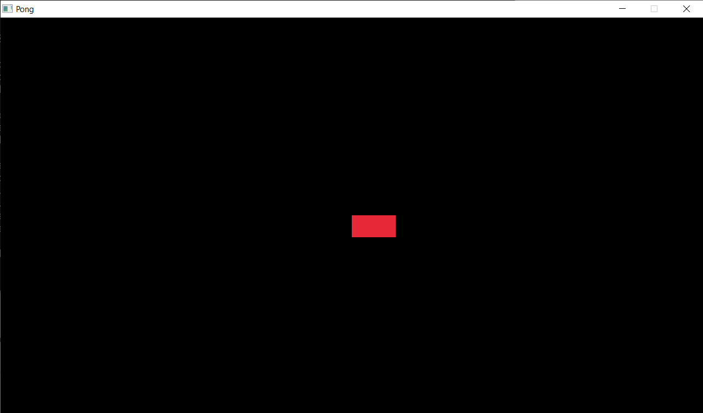

Well, that's strange! The square seems to have stretched 40 units to the right and has become a rectangle. Did we make a mistake? No. Well, not in the state code anyways. 

You see, when rendering graphics, we need to make sure we're rendering the current state *exclusively*, and not the previous frames' state. In here, we have the state *before* we pressed right, and the state *after* pressing the right arrow key. Because we're not clearing the screen of the original state's visual output, the new visual output and old ones have been merged together. A combination of Frame 1 + Frame 2. The current order of rendering looks like this:

- Draw red square at `(640, 360)`

- Present to the screen

- **== NEW FRAME ==**

- Draw red square at `(640, 400)`

- Present to the screen

All that we need to do to fix this is to just clear the screen of whatever graphics we rendered to it before we render the new graphics. In Raylib, the function for this is called `ClearBackground()`. Let's choose black for now as our clear color.

```cpp
    Vector2 player_position = { 640, 360 };

    while (!WindowShouldClose())
    {
        if (IsKeyPressed(KEY_RIGHT))
        {
            player_position.x += 40;
        }

        ClearBackground(BLACK);
        BeginDrawing();
        DrawRectangle(player_position.x, player_position.y, 40, 40, RED);
        EndDrawing();
    }
```

Now that we're *clearing* the screen — effectively **erasing** all the contents of it — before we *draw* in it, our order of rendering looks more like this.

- Clear the screen

- Draw red square at `(640, 360)`

- Present to the screen

- **== NEW FRAME ==** 

- Clear the screen

- Draw red square at `(640, 400)`

- Present to the screen

Let's run it now and move right 3 times.


That's more like it. Now, let's try duplicating the logic for this across all 4 directions.

```cpp
        if (IsKeyPressed(KEY_RIGHT))
        {
            player_position.x += 40;
        }
        if (IsKeyPressed(KEY_LEFT))
        {
            player_position.x -= 40;
        }
        if (IsKeyPressed(KEY_UP))
        {
            player_position.y -= 40;
        }
        if (IsKeyPressed(KEY_DOWN))
        {
            player_position.y += 40;
        }
```

If we run it:


It finally works! We have our own player of sorts now.

## Continuous Movement

You'll notice that currently our movement is discrete. We move 40 units, every time we press an arrow key. But we'd rather have our movement be **continuous**; we don't want to move just *once* when we *press* a key, we want to move **continuously** as we're **holding** a key down.

To do this, we just need to change the function we're using `IsKeyPressed()` to the more appropriate `IsKeyDown()` instead, which will return `true` as we're holding a key down.

```cpp
        if (IsKeyDown(KEY_RIGHT))
        {
            player_position.x += 40;
        }
        if (IsKeyDown(KEY_LEFT))
        {
            player_position.x -= 40;
        }
        if (IsKeyDown(KEY_UP))
        {
            player_position.y -= 40;
        }
        if (IsKeyDown(KEY_DOWN))
        {
            player_position.y += 40;
        }
```

If we run it now, we can see that it kinda works, but something's off.


In the GIF it's a little choppy, but that's only because it's at 30 fps. Putting that aside, our player is moving way too fast. How come? Well, when we look at the code again, we can see that we're moving 40 pixels at once everytime the player moves, also, we check for input every loop (frame), so if we hold the key down, what this effectively means is we're moving 40 pixels each frame, which is obviously more than we'd want. What we'd like to have instead is to have the player move 40 pixels per *second*, which is totally different from 40 pixels per frame.

We know at this point that the amount of times the game loop is executed in one second is known as the frames per second of our game (FPS), the "frame" in this context refers to the visual output to the screen, which is the final part of the game loop if you'd remember. However, we're going to use the term "frame" here to refer to the execution of the game loop in its entirety, and not just the literal visual output on the screen, which is common in game development.

Since we're doing this movement each frame, it stands to reason that if we increase or decrease the FPS of our game the speed of the movement will follow suit. You can experiment with this and see that it's true.

We can demonstrate this mathematically. If we add 40 to position per frame @ 60 FPS, we'll have a total displacement of **2400** per second.


If we try set our FPS to 120, or just demonstrate this mathematically again, we can see that the total displacement per second changes.


This is obviously a big problem, since we don't want something like our movement speed to be dependent on the game's FPS, as this can cause undesired and unpredictable behavior, and can give some players advantages over others depending on what FPS their machine can or cannot handle.

In Raylib, there's a function called `SetTargetFPS()` to set the FPS for us. By default the target FPS is set to match the current monitor's refresh rate, but for the sake of consistency let's just set the target FPS to 60 before the initialization of our window.

```cpp
    SetTargetFPS(60);
    InitWindow(1280, 720, "Pong");
```

## Delta Time

Well now that we know why our player is moving much faster than we'd like, what's the solution? Since the reason for the high speed is because it's correlated to the frames of our game, what we need to do is find some way to *decouple* our game's logic from the FPS. In order to do this, we need to take the *delta time* of our game, also known as the *frame time*, and multiply it by all variables which we want to be *per second* rather than *per frame*.

That's quite a lot to take in, but let's break it down. The delta time (frame time), as you may tell, is just simply the amount of time it takes to execute one frame or loop of our game. If the frames per second tells us how many frames are done per second, this is the complete opposite, it tells us how many seconds it takes to do one frame. We can get the delta time by dividing 1 by the FPS. For 60 FPS, the frame time is 0.01666 seconds, or 16.66 miliseconds, equivalent to $1\over60$.

??? note "Real delta time"

    In real games, the delta time is actually acquired manually, by taking the time (in seconds) at the current frame, and subtracting from the time of the previous frame.
    
    `delta_time = current_time - previous_frame_time`

So what happens when we multiply this number by our time-dependent variables? What happens is the 40 units we wanted to move per second, are in-fact being moved per-frame but at a much slower rate than 40. How much slower? *Just* slow enough for it to complete 40 units by the time 1 second passes.

We can illustrate this demonstration again for 60 FPS.


As you can see, the total displacement per second now is at around 40, which is our desired result. Just as importantly, if we test this on a different FPS like 120, our end result remains the same.


We can prove that the total displacement per seconds will always be the same regardless of the current FPS using this method mathematically. If $40$ is our desired per second displacement, and we are displacing at a rate of $60$ frames per second, multiplying by delta time is the same as dividing $40$ by $60$, and we're displacing $60$ times in one second so the total displacement in seconds would look like:

${40\over60}\times60=40$

The division by 60 and multiplication by 60 cancel each other out, leaving only 40. This is obviously true for other FPS rates as well.

!!! note

    This solution is not perfect. Games that require a lot of precision such as online games or fighting games need more precise solutions for decoupling FPS and game logic, and we will cover a few of them later on.
    
    This solution however is good enough for most cases, and it's what we'll be using for now. 

In Raylib, the function for acquiring the frame time is simply called `GetFrameTime()`, let's go ahead and store it first thing in our loop.

```cpp
    while (!WindowShouldClose())
    {
        float delta_time = GetFrameTime();
        ...
        ...
    }
```

Now let's take all the instances of us translating the player position by 40 units and multiply it by our delta time.

```cpp
        float delta_time = GetFrameTime();
        if (IsKeyDown(KEY_RIGHT))
        {
            player_position.x += 40 * delta_time;
        }
        if (IsKeyDown(KEY_LEFT))
        {
            player_position.x -= 40 * delta_time;
        }
        if (IsKeyDown(KEY_UP))
        {
            player_position.y -= 40 * delta_time;
        }
        if (IsKeyDown(KEY_DOWN))
        {
            player_position.y += 40 * delta_time;
        }
```

And let's see what we get:


Well it's rather slow, but then again 40 pixels per second isn't that fast to begin with. What's important is that it works! Now that we got that out of the way we can actually begin to work on our game.
