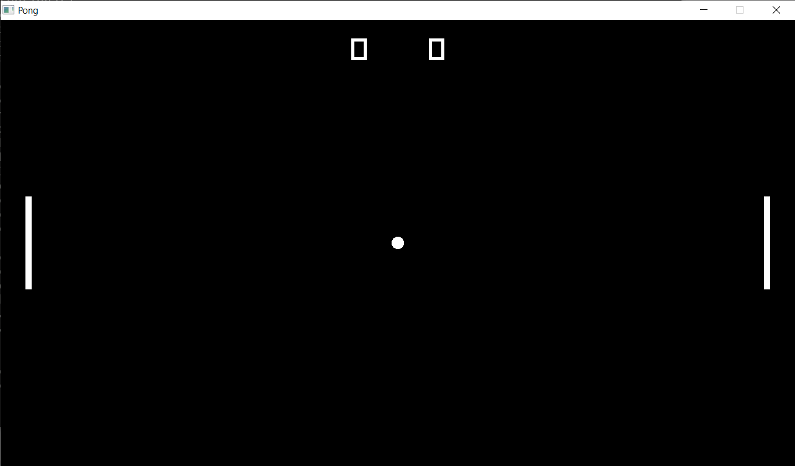
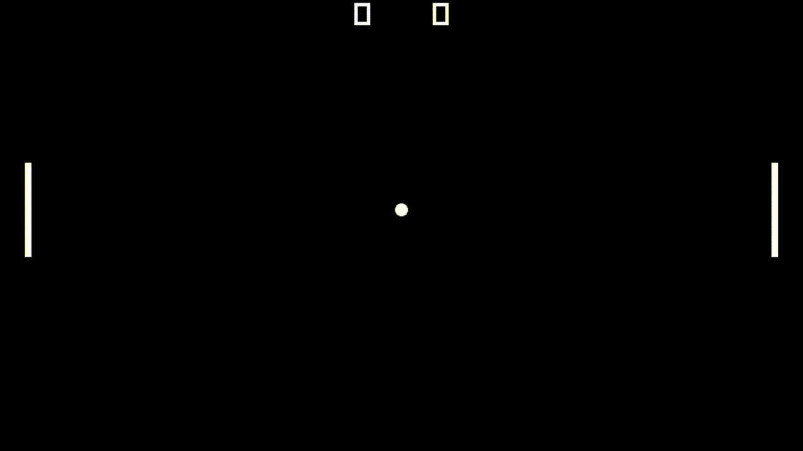
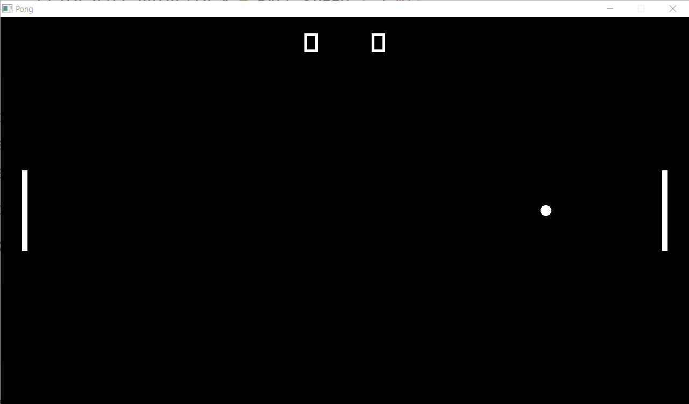
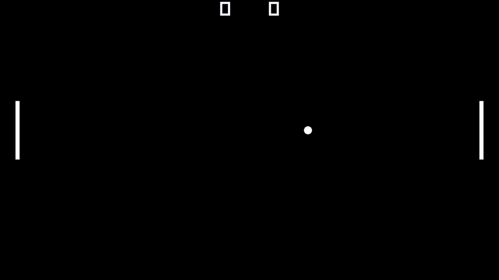
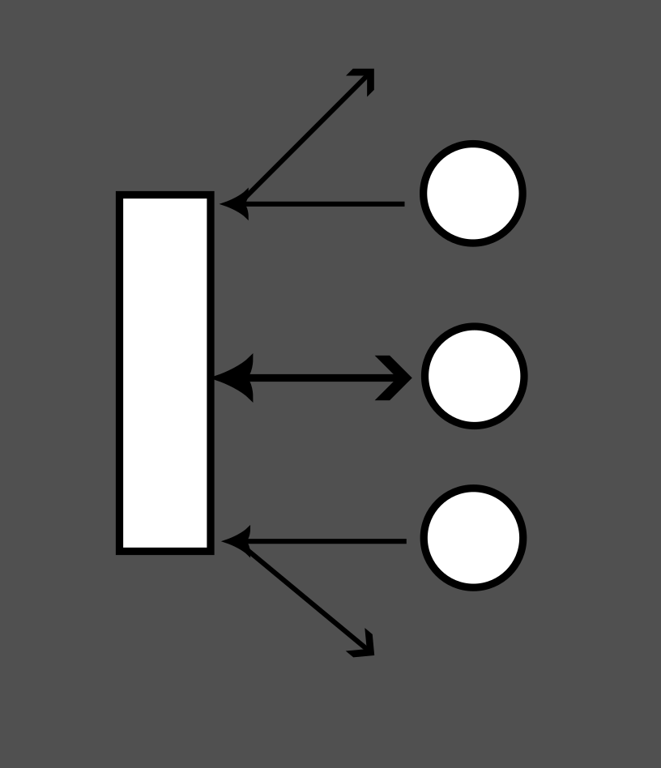
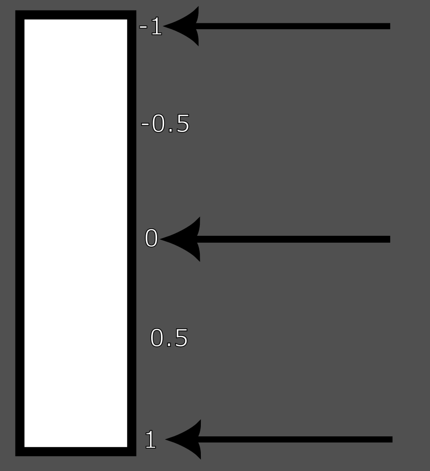
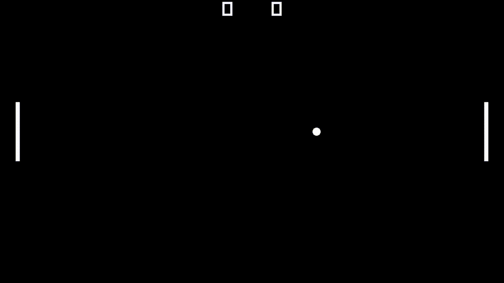
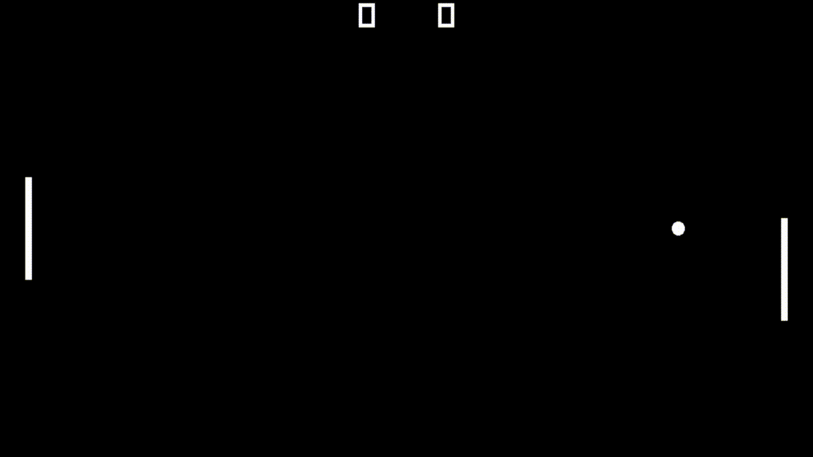
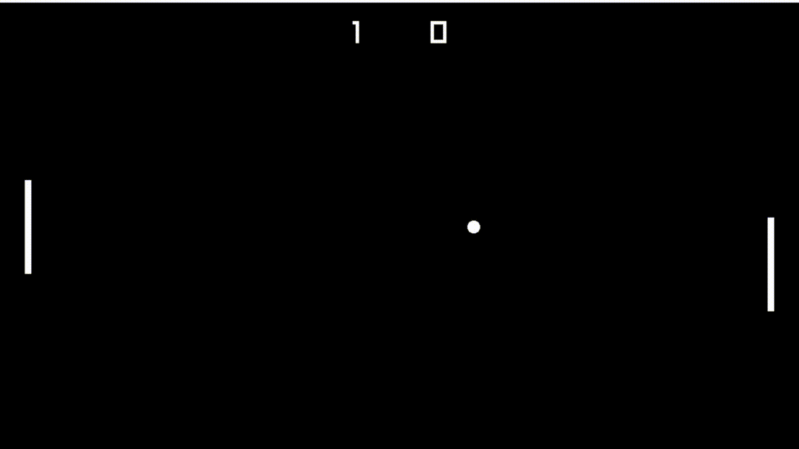
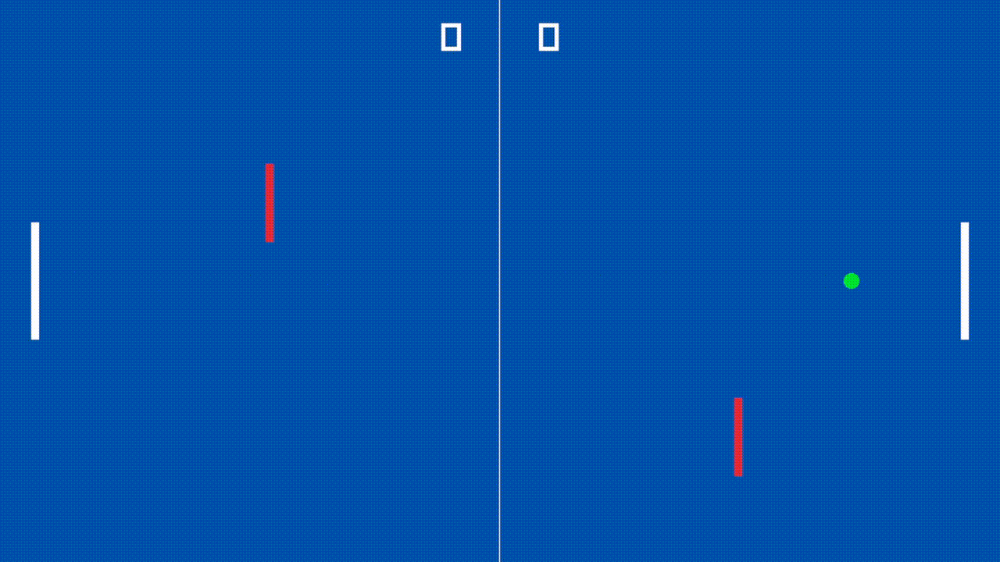

# 3. Making Pong

## Structure

The game that we're gonna be making is Pong, the first video game made.


There is a ball in the middle, and two paddles. The ball goes to one paddle which then hits it, and sends it back to the other paddle, if one of them fails to hit and enters their goal, that's a score for the other paddle. Really an extremely simple game.

What we should first do is define the structure when we're making it. In this case, there are just a few elements we have to consider:

- There are two paddles
  
  - 1 left and 1 right
  
  - They can only go up and down
  
  - They can hit the ball to bounce it off to the other end

- There's a ball
  
  - It bounces off the top and bottom of the screen
  
  - It bounces off the paddles
  
  - If it enters a paddle's goal then it's a score for the other paddle

- If a goal is scored the ball and paddles are both reset to the center

- There is text on the top part of the screen of the paddles' scores

Let's do some housekeeping with our current code before we move any further:

```cpp
const int SCREEN_WIDTH = 1280;
const int SCREEN_HEIGHT = 720;

int main()
{
    SetTargetFPS(60);
    InitWindow(SCREEN_WIDTH, SCREEN_HEIGHT, "Pong");

    while (!WindowShouldClose())
    {
        float delta_time = GetFrameTime();

        ClearBackground(BLACK);
        BeginDrawing();
        EndDrawing();
    }
```

OK. Now let's try defining the structure of our game state. There are three main parts to it: the paddles, the ball, and the score.

```cpp
struct GameState
{
    Rectangle right_paddle;
    Rectangle left_paddle;

    Ball ball;

    int left_score;
    int right_score;
};
```

`Rectangle` is a struct in Raylib, it has four properties.

```cpp
// Rectangle, 4 components
typedef struct Rectangle {
    float x;                // Rectangle top-left corner position x
    float y;                // Rectangle top-left corner position y
    float width;            // Rectangle width
    float height;           // Rectangle height
} Rectangle;
```

We'll use this struct to represent our paddle, which is simple enough. `Ball` on the other hand though, is a struct of our own that we haven't defined yet. We will define this struct later. We also have two `int` variables for our left and right scores. And really, this is all the state that we need for our game.

There are three parts to our program: Initialization, then Updating and Drawing in a loop. Let's write these three as functions that take in `GameState` as a parameter.

```cpp
void InitGame(GameState& state);
void UpdateGame(GameState& state);
void DrawGame(GameState state);
```

!!! note "Passing by reference"

    Notice that we placed an ampersand (&) in the `GameState` parameters of `InitGame` and `UpdateGame`. This is because we want to pass in the state as a reference. In other words, we want the `InitGame` and `UpdateGame` functions to actually *modify* the state that it receives *for good*, and not just take it as a copy to do calculations on.

Let's rewrite our `main` function now:

```cpp
int main()
{
    GameState state;
    InitGame(state);

    while (!WindowShouldClose())
    {
        UpdateGame(state);
        DrawGame(state);
    }

    return 0;
}
```

When we write our code this way, the structure of our game becomes much clearer. In reality, many games/game engines follow a pattern similar to this one. Let's write some of the code for the actual functions themselves now.

```cpp
void InitGame(GameState& state)
{
    SetTargetFPS(60);
    InitWindow(SCREEN_WIDTH, SCREEN_HEIGHT, "Pong");
}

void UpdateGame(GameState& state)
{
}

void DrawGame(GameState state)
{
    ClearBackground(BLACK);
    BeginDrawing();
    EndDrawing();
}
```

Here this is just boilerplate of the same code we had earlier in `main`, you'll notice the Update function is left empty, this is because we don't yet have any logic for the game yet. We'll change that soon, but now, we have to actually define our `Ball` struct.

The ball is similar to the paddles in the way that we don't need to store the ball's size since it's constant; the size won't ever change (unless we want it to later). One way in which they're different however, is that we actually need to store the ball's velocity. The reason is that the ball's velocity is determined solely by the angle of the paddle it hits, or when the game resets. In both these cases, we can't determine the resulting velocity in any given frame, we can only determine the velocity on the exact frame the collision or reset happens. Since we don't want to reset the velocity every frame, the only way we can tell these things is if we retain the data between frames (from the previous frame to the current one, and so on).

When we think about the ball as mutable or variable state, there are only 2 things we have to keep track of: it's position, and it's velocity (movement). We obviously want to know it's position so that we can know the state of the board and the game, but we also want to store the velocity as a variable since we want to keep track of whatever the movement vector is if the ball hit a paddle for example. We don't really have to store the radius as a variable, since it's more of a constant.

```cpp
struct Ball
{
    Vector2 position;
    Vector2 velocity;
};
```

That concludes this segment of us setting up the data, now let's actually write some code for the game's logic.

## Initializing and Drawing

The first thing that we need to do is initialize the actual games state, and establish how we're gonna draw the state.

To initialize the state, we want to do just a couple of things:

- Zero out the score

- Place the ball in the center

- Set the ball's velocity to move to the right

- Place both paddles in the center, in their respective sides

Writing this out in code is quite simple enough. First let's just establish some constants that will be useful for us in these calculations. Let's also establish the constants for the paddle's sizes and the ball's radius. For the paddle we're just gonna go for a 10 wide and 150 tall rectangle, and the ball has a radius of 10 pixels.

```cpp
const int SCREEN_TOP = 0;
const int SCREEN_BOTTOM = SCREEN_HEIGHT;
const int SCREEN_LEFT = 0;
const int SCREEN_RIGHT = SCREEN_WIDTH;
const Vector2 SCREEN_CENTER = { SCREEN_WIDTH / 2.0, SCREEN_HEIGHT / 2.0 };

const Vector2 PADDLE_SIZE = { 10, 150 };
const float BALL_RADIUS = 10.0f;
```

Now let's get to writing the initialization code.

```cpp
const float PADDLE_OFFSET_FROM_EDGE = 40.0f;

void InitGame(GameState& state)
{
    SetTargetFPS(60);
    InitWindow(SCREEN_WIDTH, SCREEN_HEIGHT, "Pong");

    // set the ball position to the center
    state.ball.position = SCREEN_CENTER;
    // we want it to move right, we'll place 400 for now
    state.ball.velocity.x = 400; // placeholder value

    // set the paddles' sizes
    state.left_paddle.width = PADDLE_SIZE.x;
    state.left_paddle.height = PADDLE_SIZE.y;

    state.right_paddle.width = PADDLE_SIZE.x;
    state.right_paddle.height = PADDLE_SIZE.y;


    // set the paddles' positions
    state.left_paddle.x = SCREEN_LEFT + PADDLE_OFFSET_FROM_EDGE;
    state.left_paddle.y = SCREEN_CENTER.y - PADDLE_SIZE.y * 0.5f;

    state.right_paddle.x = SCREEN_RIGHT - PADDLE_OFFSET_FROM_EDGE - PADDLE_SIZE.x;
    state.right_paddle.y = SCREEN_CENTER.y - PADDLE_SIZE.y * 0.5f;

    state.left_score = 0;
    state.right_score = 0;
}
```

We're setting the paddle positions on the x axis by declaring a constant describing how big of a margin we want between the paddles and the edge of the screen, and also making sure to subtract the `PADDLE_SIZE.x` from the right paddles position taking into account that the origin of the rectangle is in the top-left. For the vertical position we just set it to the `SCREEN_CENTER.y` subtracting half the `PADDLE_SIZE.y` to make sure it's properly aligned in the center (keep in mind again that the origin of the rectangle is in the top-left).

This initialization code seems good for now, so let's try drawing the state. This is what our `DrawGame()` function looks like right now.

```cpp
void DrawGame(GameState state)
{
    ClearBackground(BLACK);
    BeginDrawing();
    EndDrawing();
}
```

Let's add the paddles.

```cpp
    DrawRectangleRec(state.left_paddle, WHITE);
    DrawRectangleRec(state.right_paddle, WHITE);
```

`DrawRectangleRec` is the same as `DrawRectangle` except it takes in a `Rectangle` struct as input, instead of 4 variables being manually set.

Now the ball. We're going to use the `DrawCircle()` function which takes in four arguments: `centerX, centerY, radius, color`.

```cpp
    DrawCircle(state.ball.position.x, state.ball.position.y, BALL_RADIUS, WHITE);
```

Finally, let's draw the text of the paddles' score. Here we'll use the `DrawText()` function which takes in five arguments: `text, posX, posY, fontSize, color`. For the `text` parameter, we'll format it the old-school way using the `TextFormat()` function provided by Raylib.

```cpp
    DrawText(
        TextFormat("%d", state.left_score), // text
        SCREEN_CENTER.x - 75, // x position
        SCREEN_TOP, // y position; top of the screen
        50, WHITE); // font size, color
    DrawText(
        TextFormat("%d", state.right_score), // text
        SCREEN_CENTER.x + 50, // x position
        SCREEN_TOP, // y position; top of the screen
        50, WHITE); // font size, color
```

And we're done. By the end, this is what our `DrawGame()` function should look like:

```cpp
void DrawGame(GameState state)
{
    ClearBackground(BLACK);
    BeginDrawing();

    // Paddles
    DrawRectangleRec(state.left_paddle, WHITE);
    DrawRectangleRec(state.right_paddle, WHITE);

    // Ball
    DrawCircle(state.ball.position.x, state.ball.position.y, BALL_RADIUS, WHITE);

    DrawText(
        TextFormat("%d", state.left_score), // text
        SCREEN_CENTER.x - 75, // x position
        SCREEN_TOP, // y position; top of the screen
        50, WHITE); // font size, color
    DrawText(
        TextFormat("%d", state.right_score), // text
        SCREEN_CENTER.x + 50, // x position
        SCREEN_TOP, // y position; top of the screen
        50, WHITE); // font size, color

    EndDrawing();
}
```

With our state initialized and draw code written, once we build it, this is what it should look like.



Now we finally have something resembling a game on our hands. Now that we're done with this slightly tedious part we can finally get to the good part: coding the game logic.

## Game Logic

When we think about what we need to do for the game logic, there are a number of things we need to implement.

- The paddles must move up and down according to player input

- The ball must also move according to its determined velocity
  
  - Velocity is determined when it bounces against a paddle   
  
  - It's vertical velocity is also flipped if it hits the top or bottom edge of the screen

- If a paddle scores a goal, the paddles and the ball must be reset, and the score updated

Simple enough, right? Let's take them on one at a time. First, the paddles movement.

## 1. Paddle Movement

We covered movement in the beginning part of this section, so this should be easy enough to implement. We'll use continuous movement here, storing player input into a temporary velocity variable that we'll then use to actually displace the paddles' positions. For the left paddle, W and A will be the keys to move up and down, and for the right, UP arrow and DOWN arrow will move it. Before we do that though, we should declare a constant to describe how fast we want the paddle to move. Remember that this will be a *pixels per second* metric. Let's set it to the screens height so each paddle can cover the entire side of their goal within 1 second.

```cpp
const float PADDLE_SPEED = (float)SCREEN_HEIGHT;
```

Now let's write the movement code. Don't forget to multiply the position displacement by delta time so it moves per second rather than per frame.

```cpp
void UpdateGame(GameState& state)
{
    float delta_time = GetFrameTime();

    float right_velocity = 0.0f;
    if (IsKeyDown(KEY_UP))
    {
        right_velocity -= PADDLE_SPEED;
    }
    if (IsKeyDown(KEY_DOWN))
    {
        right_velocity += PADDLE_SPEED;
    }

    float left_velocity = 0.0f;
    if (IsKeyDown(KEY_W))
    {
        left_velocity -= PADDLE_SPEED;
    }
    if (IsKeyDown(KEY_S))
    {
        left_velocity += PADDLE_SPEED;
    }

    state.left_paddle.y += left_velocity * delta_time;
    state.right_paddle.y += right_velocity * delta_time;
}
```

Let's build it and see what we get.



That's that part done. Now let's try to get the ball moving.

## 2. Ball's movement

First off, let's declare a constant just like we did with the paddles to describe how fast the ball should move horizontally, and replace the placeholder value in the Initialization function. Let's go with 900 for now, which will make it cross the screen in about a second and a half.

```cpp
const float BALL_SPEED = 900.0f;

...


void InitGame(GameState& state)
{
    ...
    state.ball.velocity.x = BALL_SPEED / 2.0f;
    ...
}
```

I chose to divide the speed by half in the Initialization, and will also do that when the ball is reset via goal since I think it's better to give players a little time to reposition before the round kicks off.

Now let's just apply the movement in the Update function.

```cpp
    state.ball.position.x += state.ball.velocity.x * delta_time;
    state.ball.position.y += state.ball.velocity.y * delta_time;
```

Let's try running now.



We can see that the ball is in fact moving towards the right. Except, when it reaches the paddle it simply goes through it. The next step for us is to implement basic collision.

### 2.1 Collision Detection

Raylib already comes with functions for basic collision detection. The one we're interested in is `CheckCollisionCircleRec()`, which takes in three arguments: `center, radius, rec`. The `rec` is of type `Rectangle`.

We already know the ball's position and radius, and the paddles are already of the `Rectangle` type, right now let's just try and create simple collision detection that flips the horizontal direction of the ball at max speed if it collides with a paddle.

```cpp
    // if collided right paddle, go left
    if (CheckCollisionCircleRec(
            state.ball.position,
            BALL_RADIUS,
            state.right_paddle))
    {
        state.ball.velocity.x = -BALL_SPEED;
    }
    // if collided left paddle, go right
    if (CheckCollisionCircleRec(
            state.ball.position,
            BALL_RADIUS,
            state.left_paddle))
    {
        state.ball.velocity.x = BALL_SPEED;
    }
```

Let's run it.



It works right. However the ball is always going to move in the same direction regardless of the angle of its collision with the paddle. In Pong, the angle of the ball's movement is determined by which part of the paddle it hit. So let's get to work on that now.

### 2.2 Reflection

The basic idea behind the reflection of the ball is that the closer the ball collides with the edge, the greater the angle of its velocity.



One way that we can solve this in code is to make a relation between the vertical (y-axis) velocity of the ball and it's distance from the center of the paddle. We'll take the difference between the ball's position and the paddle's center. Then we'll divide by half the height of the paddle ($Paddle\ Height\over2$), i.e. the distance from the top/bottom edge of the paddle to the center, so that the result is normalized from 0 at the ball's center, and 1 at the edge.



We'll call this the angle percent, because I don't really have a better name for it. The formula for it is as follows.

$Angle\ Percent={{Ball\ Position\ Y-Paddle\ Center\ Y}\over {Paddle\ Half\ Width}}$

Once we have this percentage, we can just multiply whatever maximum vertical velocity we want by it. In order to get the paddle's vertical center, we just take the position of its top edge (i.e., it's `position.y` variable) and add half the height to it.

$Paddle\ Center\ Y=Paddle\ Top\ Edge+{Paddle\ Height\over2}$

Let's write this out in code so we can get a better idea of it. Let's declare this maximum vertical velocity that we want as a constant.

```cpp
const float BALL_MAX_VERTICAL_VELOCITY = 180.0f;
```

Now let's write out the formula.

```cpp
    if (CheckCollisionCircleRec(
            state.ball.position,
            BALL_RADIUS,
            state.right_paddle))
    {
        float paddle_center = state.right_paddle.y + PADDLE_SIZE.y * 0.5f;
        float angle_percent = (state.ball.y - paddle_center) / (PADDLE_SIZE.y * 0.5f);
        state.ball.velocity.y = BALL_MAX_VERTICAL_VELOCITY * angle_percent;
        state.ball.velocity.x = -BALL_SPEED;
    }
    if (CheckCollisionCircleRec(
            state.ball.position,
            BALL_RADIUS,
            state.left_paddle))
    {
        float paddle_center = state.left_paddley + PADDLE_SIZE.y * 0.5f;
        float angle_percent = (state.ball.position.y - paddle_center) / (PADDLE_SIZE.y * 0.5f);
        state.ball.velocity.y = BALL_MAX_VERTICAL_VELOCITY * angle_percent;
        state.ball.velocity.x = BALL_SPEED;
    }
```

To make the results more reliable, we'll check for collision with a paddle only if the ball is moving in the paddle's direction. This will guarantee that a ball doesn't collide with the same paddle 2 consecutive frames in a row, if it happens to have partially clipped inside it.

```cpp
    if (state.ball.velocity.x > 0) // if moving right
    {
        if (CheckCollisionCircleRec(
                state.ball.position,
                BALL_RADIUS,
                state.right_paddle))
        {
            float paddle_center = state.right_paddley + PADDLE_SIZE.y * 0.5f;
            float angle_percent = (state.ball.y - paddle_center) / (PADDLE_SIZE.y * 0.5f);
            state.ball.velocity.y = BALL_MAX_VERTICAL_VELOCITY * angle_percent;
            state.ball.velocity.x = -BALL_SPEED;
        }
    }
    if (state.ball.velocity.x < 0) // if moving left
    {
        if (CheckCollisionCircleRec(
                state.ball.position,
                BALL_RADIUS,
                state.left_paddle))
        {
            float paddle_center = state.left_paddle.y + PADDLE_SIZE.y * 0.5f;
            float angle_percent = (state.ball.position.y - paddle_center) / (PADDLE_SIZE.y * 0.5f);
            state.ball.velocity.y = BALL_MAX_VERTICAL_VELOCITY * angle_percent;
            state.ball.velocity.x = BALL_SPEED;
        }
    }
```

OK. Let's build and try it out.



Almost done! Only thing left to do now is to fix the ball not colliding with the top and bottom edges of the screen, which is probably the easiest thing to code here.

### 2.3 Ceiling / Floor Bounce

In order to get the ball to bounce from the top and bottom edges of the screen, all we need to do is check the top and bottom edge of the circle, and whether or not it's exceeded the respective top and bottom edge of the screen. If it did, we'll simply reverse the vertical velocity to the opposite direction.

So if the bottom edge of the circle collided with the bottom edge of the screen, we would take the current vertical velocity `ball.velocity.y` and force it to be positive. Likewise with the top ceiling. To force the sign of the velocity, we could just multiply by -1, but that might be unreliable since the ball might be touching an edge of the screen for more than 1 frame if it's gone fast enough to go far off-screen. To fix that, we'll only check for a ceiling/floor hit if its moving in that direction.

```cpp
    if (state.ball.velocity.y > 0) // if moving down
    {
        // if bottom edge of ball is greater than bottom edge of screen
        if (state.ball.position.y + BALL_RADIUS > SCREEN_BOTTOM)
        {
            state.ball.velocity.y *= -1;
        }
    }
    if (state.ball.velocity.y < 0) // if moving up
    {
        // if top edge of ball is greater than top edge of screen
        if (state.ball.position.y - BALL_RADIUS < SCREEN_TOP)
        {
            state.ball.velocity.y *= -1;
        }
    }
```

Let's build it and run.



The ball may seem to clip on the edges before bouncing, this is only because the capture doesn't show the full window however. We're done with the ball now. The final step now is to implement the goal and scoring.

## 3. Scoring Rounds

This is also a very simple task. For this one all we have to do is see if the ball's position has touched or exceeded the right or left edge of the screen, no need to calculate for the right and left edge of the ball precisely, since this mostly will not affect gameplay in any serious way. If the ball did in-fact collide with the right or left edge, we will reset the ball's position and velocity, and increment the appropriate paddle's score.

```cpp
    if (state.ball.position.x >= SCREEN_RIGHT)
    {
        // ball entered right goal; left scored
        state.left_score++;
        state.ball.position = SCREEN_CENTER;
        state.ball.velocity.y = 0.0f;
        state.ball.velocity.x = BALL_SPEED * 0.5f;
    }
    if (state.ball.position.x <= SCREEN_LEFT)
    {
        // ball entered left goal; right scored
        state.right_score++;
        state.ball.position = SCREEN_CENTER;
        state.ball.velocity.y = 0.0f;
        state.ball.velocity.x = BALL_SPEED * 0.5f;
    }
```

Let's run it.



It works, and now we're done! We've finally made Pong, in it's entirety.

## Tasks

There will be a version of the final `pong.cpp` file available for you, though we recommend stepping through the tutorial yourself and seeing the code get written and why it is the way it is. You are now tasked with modifying this game in three ways. In order of difficulty:

1. Change the colors of the game, to whichever you prefer

2. Draw a white vertical line in the middle of the board

3. Create two small thin obstacles, one on the left and right, such that if the ball collides with either of them its horizontal velocity `ball.velocity.x` will be flipped. (Don't worry about the collision detection not being perfect or slightly buggy, that won't be a factor for the task.)



**Hints:**

- Look at the Raylib cheatsheet for important functions

- Use `DrawLine()` for the line

- Create two `Rectangle` structs for the obstacles inside of `GameState`

## Conclusion

This concludes our first tutorial on making your first game. Though we won't be using Raylib for the rest of the series, hopefully this tutorial was a good introduction into game programming, and how to think like a game programmer. Although we'll be transitioning to Godot from now on, don't forget that these principles you've learned will still be very important when you're actually programming. The frameworks may be different but the concepts are the same.

See you next week!
