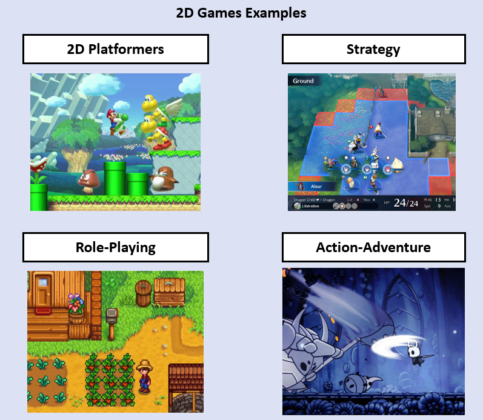
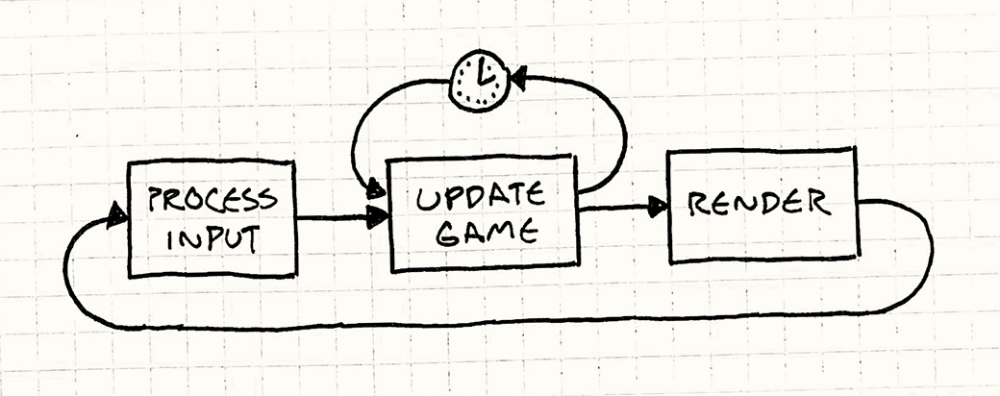
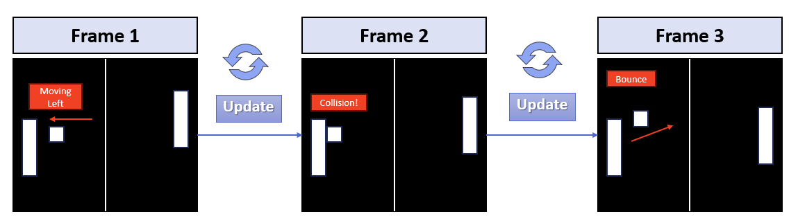

# Introduction

## Welcome!

Welcome to the first week of the game development track! In this week, we will discuss the bare basics of game development. Starting from just the simple definition of a game, moving onto the reality of **how video games actually work,** and finally **making our own first game** to top it off.

## What is a game?

Most of us have a pretty intuitive notion of a game, right? The word "game" can include games such as Monopoly or Chess.

We can say that a game is a **structured activity** where players can **make decisions** and **take actions** within the **rules** of a game to **achieve a specified goal,** and they can either **win or lose** in doing that.

When it comes to **video games** however, we typically think of **virtual worlds.** With many **characters, objects, and environments.** And this is true. Despite this however, a video game is still a **game,** and the same principles of ordinary games apply.

There are many different types of games. They are classified by genres, and often along the gameplay style, rules, themes, and other elements.



## Video Games

Video games - as software - all have some **common components** to them. Almost every game has, at least some of:

- **A Graphics System:** Responsible for displaying graphics to the screen.

- **An Audio System:** Responsible for audio and playing sounds of the game.

- **A Physics System:** Responsible for physics of players and objects.

- **An Input System:** Takes in the input of the player (keyboards, controllers, etc...)

- **Game Logic:** A logic and set of rules dictating the state of the game and what the player can and cannot do, and how the game state responds to player input.

- **Many Other Components...**

When we look at all these technical components that make up a video game, they are plentiful, but they all work together to create one, coherent experience for the player. Thus we can say that **video games** are the **interplay** of **many technical components,** to produce a **player experience** with **rules and constraints** that can be **won or lost.**


## The Game Loop

We mentioned that video games are comprised of many technical components. All of these components are **updated** in a fixed "loop" throughout the entirety of the game, called the **"game loop"**.



The game loop first **processes player input** (such as from the keyboard, mouse movements, or buttons pressed on a controller), then **updates the game state** based on this input and other variables, finally it **draws** (renders) this state **visually to the screen.** This process repeats itself ad infinitum **(forever)** until the game ends.

***Example Game Loop Code***

```cpp
int main()
{
    // Initializing the technical components / subsystems
    InitGame();

    // The game loop, it repeats continuously until the game ends
    while (GameIsRunning)
    {
        // ====== NEW FRAME ======
        
        // Operating system work is done here
        // Receiving input from keyboard-mouse-controller
        // And checking OS events (did the window close? or minimize? etc)
        // Not the subject of our focus for this track
        ProcessInput();
        
        // The actual game's state
        // (players position and health, enemies, inventory, etc...
        // is updated here
        UpdateGame();

        // The game's state is rendered (drawn) to the screen graphically here
        RenderGame();

        // ====== END OF FRAME ======
    }

    // We exitted the loop (GameIsRunning == false)
    // Quit the game
    ExitGame()
}
```

Effectively, all video games run in one big `while` loop. The number of times a loop is completed in one second is called the **"frames per second" (FPS)** of a game. **"Frame"** refers to the visual output of the game to the screen, the final step of the loop before repeating. Generally, a **higher FPS** means a **smoother experience** for the player.

## Pong

Pong is the first video game ever made, it's basically an extremely simple top-down tennis of sorts. Here is some footage of the gameplay and an example of what the game's loop would look like.


***Example Pong Game Code***

```cpp
while (GameIsRunning)
{
    // ===== NEW FRAME =====

    ProcessInput();

    if (QuitButtonPressed())
    {
        GameIsRunning = false;
    }

    MovePaddles();

    MoveBall();

    CheckBallCollisionsAndBounce();

    if (BallImpactedSide(LEFT_PLAYER))
    {
        IncrementScore(RIGHT_PLAYER);
        ResetBall();
    }
    if (BallImpactedSide(RIGHT_PLAYER))
    {
        IncrementScore(LEFT_PLAYER);
        ResetBall();
    }

    RenderPlayfield();

    // ===== END OF FRAME =====
}
```

On a more granular level, this is an example of what each frame of the game would look like as it's being updated. Remember that **"update"** here just means that we're **repeating** this loop once again.



## Making our Own Game

Don't worry if you don't understand all of this just yet. In the next section of this week, we will get started on actually trying to create pong for ourselves using Raylib and C++. If you don't understand anything about the example code for Pong, you'll understand it soon enough when you follow the tutorial.

The important thing to take away from this section is this:

- Video games run in a fixed loop, called the game loop

- This loop updates the state of the game, and draws it to the screen graphically, then repeats that process until the game is over

- The game is comprised of many technical components, all of which are updated in the loop and play a role in completing the game experience for the player
