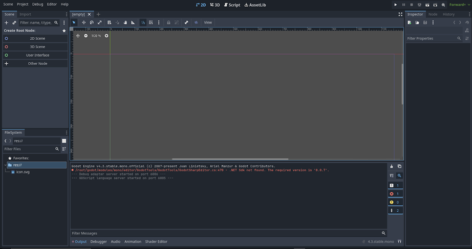
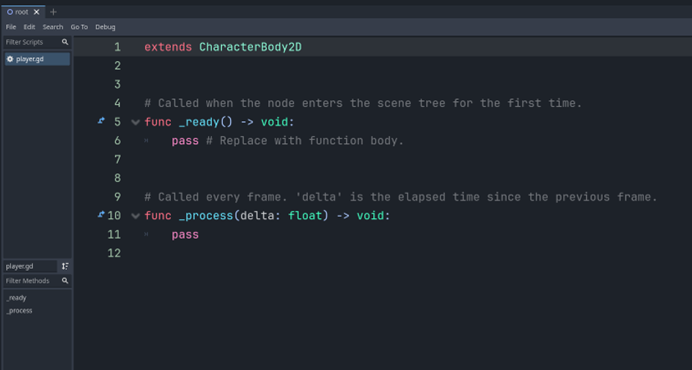

# Creating a Moving Square

Now that we have a rough overview of Godot’s core concepts, let’s try them out in practice. Let’s try recreating our moving red square from our introduction last week and make obstacles that it can collide with.

## Installing Godot

Godot is a light-weight engine; the entire engine is just one executable file. Godot can be downloaded from [this link](https://godotengine.org/download/).


## Getting Started

Once you first open Godot, you'll be taken to the *"Projects"* screen, where you can manage all your projects.


Let's go ahead and create our first project, you can call it anything you like. After we create our project, we'll be greeted by this screen.



This is the Godot interface. You can learn more about the details of the interface and how to navigate it in the Godot Resources section.

Let’s choose to create a 2D scene. This will create a “Node2D” node as the root node.


Let's rename it to "Root".


## Nodes

The "Node2D" node is one of the many types of nodes available in Godot. It is the node that nearly every 2D node derives from, in other words, every 2D node has the same properties and functions of a "Node2D" plus it's own unique properties and methods.

When you try to create a new node, you'll be taken to the "Create New Node" screen, which lists all possible nodes and contains a description for each of them.


When it comes to the moving square we want to make, we have the option of just making a 2D image of a square that simply moves around. But we don't just want a picture of a moving box, we want an actual box *object* that can move and collide with other objects.

To do this, we have to use a node of type *PhysicsBody2D*. For our purposes, let's choose the *CharacterBody2D* node.


### Types of CollisionObject2Ds

*CollisionObject2D* is an abstract node. "Abstract" means that the node itself is not a real node that can exist in a scene, but other that derive from it can. Basically, "abstract" means that the node is just a "blueprint" node for other nodes to derive from. Excluding *RigidBody2D* and it's inheritor, there are four major nodes of this type.

- **CharacterBody2D**

- **StaticBody2D**

- **AnimatableBody2D (inherits StaticBody2D)**

- **AreaBody2D**


## Adding Children

Going back to our scene, we'll see that after we add our *CharacterBody2D* into the scene that nothing visually changes. Also, the node gives us a warning that it's missing a *CollisionShape2D*.


The *CharacterBody2D* node is only a node for specifying physics behaviour, but it doesn't specify anything about its <u>shape</u> or <u>look</u>. In order to add this functionality to our *CharacterBody2D*, we must simply add the two appropriate child nodes.

### The Collider - CollisionShape2D

First, let's add the *CollisionShape2D*. Right-click on the node and press *Add Child Node*.


Now let's choose *CollisionShape2D*.


Once we add the child, the warning on *CharacterBody2D* goes away but a new one on *CollisionShape2D* appears.


To fix this we must edit the properties of the node to specify an actual shape. Go to the inspector dock and let’s choose the rectangle shape for our collider.


Once we've done that, the warnings will disappear, and we should have an actual shape of a rectangle appear in our viewport. This is the shape of the *collider*, in other words, this is what our *CharacterBody2D* node will use as a <u>reference</u> to check what it is and is not colliding with at any given time.


The blue square represents the collider, this square only appears in the editor for debug purposes, it will not show when we play the game/scene.

### The Square - ColorRect

Now that we have our *CollisionShape2D* child, let's add in our visual for the square. Usually, we would choose a *Sprite2D* node for this, which takes in an image resource and displays it in 2D space. However, Godot doesn't have ready image resources for simple shapes, so for the sake of simplicity, we'll instead use a *ColorRect* node, which just draws a colored 2D rectangle.


??? note

    Technically, this node should be used for UI purposes, but we're using it in this case because it suits our needs well enough.

Once we add it in, we get this.


The rectangle is much bigger than the collider and it's off-center. Moreover, the *ColorRect* is covering the collider. This is because the *ColorRect* node comes <u>*after*</u> the *CollisionShape2D* node in the hierarchy, so it gets drawn on top of it. We can change this by moving the nodes around in the hierarchy then using the red control points on the rect to get it to allign with the collider.


!!! note

    We adjust the ColorRect node using the red points to align with the collider. Godot's editor snaps the points to the nearest pixel on a pixel grid, so this is quite easy.

## Saving the Scene

Now that our "player" box scene is ready, let's save the current scene by pressing *Ctrl + S*. This will open a *"Save Scene As..."* dialog box that will save the *root* of our scene first.

In Godot, scenes are technically files (*.tscn*), same for scripts (*.gd*). And to play a scene, Godot must have a reference to it as a file. So to play our current scene, we must save the root file first.


Once we click "*Save*", it will show up in our file system.


## Selecting and Playing the Main Scene

Let’s try to play our scene now. Our root scene should be saved in our file system, so let’s click the Play button now. It will be on the top-right part of the screen.


Once we press the play button, a dialog box will show up prompting us to select a “*main scene*”, this is the first scene Godot will play when starting the game and can change throughout the run of the game. Currently, we only have one scene in our project, *root*, so we can press *"Select"* or *"Select Current"* it doesn’t really make a difference.


If you click *Select*, you’ll be taken to the file system to choose a scene from the available ones among the files, we only have one scene, so it doesn’t matter for now.

After choosing the scene, the game will start, and the scene will play.


You can notice at the top we have the name of the project, followed by *(DEBUG)*. This indicates our game is in debug build, which means that certain functions like `debug_print()` will execute only in this mode and not in the final release build.

You can also notice our "player" is in the top-left corner of the screen, just like we had originally in our Raylib section.

## Scripting the Player

### Creating the Script

Now that we're done with creating the node configuration for our square, let's create a script for it so it can move around.

Click on the *CharacterBody2D* node and then on the button representing a script with a green plus above it to create a new script.


This will open a dialog box prompting you to specify the details of the script, such as its name and place in the file system, which node it inherits from, and whether to use a template.


For now, let's just name the script *"player.gd"* and place it in the root directory of the file system, and let's change the template to *Default*.


We now arrive at this familiar screen.



This is the script editor built-in to Godot for GDScript. You can learn more about the Godot Interface in the resources section.

### Writing the Script

By this point, you should be familiar with the code to move an object around in the screen. We know that our script extends *CharacterBody2D* which inherits *Node2D.* One of the properties of *Node2D* is a *Vector2* variable called *position*.

As you might expect, *position* is simply the objects position relative to its parent in the hierarchy (*global_position* is its true position in the coordinate space). For now, in the `_process` function, let's just move position down and to the right by adding a certain number to it and multiplying by *delta* to ensure it moves per second units by that number.

```gdscript
func _process(delta: float) -> void:
    # "position" -> property derived from Node2D
    position.x += 40 * delta
    position.y += 40 * delta
```

If we run it now, we can see our square is moving steadily down and to the right.


```gdscript
func _process(delta: float) -> void:
    var horizontal_movement : float = Input.get_axis("ui_left", "ui_right")
    var vertical_movement : float = Input.get_axis("ui_up", "ui_down")
    position.x += horizontal_movement * 40 * delta
    position.y += vertical_movement * 40 * delta
```

This is the code to get our square moving according to player input. You can put it in the script and run it to verify it's working.

Once we play our scene, we can see that the square is moving according to our input of the arrow keys properly.


## Input Maps

So what's really going on here?

```gdscript
var horizontal_movement : float = Input.get_axis("ui_left", "ui_right")
var vertical_movement : float = Input.get_axis("ui_up", "ui_down")
```

To understand what's happening here we must first understand the concept in Godot of ***Input Maps***. Input maps are a way for us to create **bindings** between certain **labels (names)**, and **keys or inputs** that <u>correlate</u> to that label.

To see these input maps in Godot, we can go to Project Settings and check out the Input Map tab to see all of our custom and built-in input maps.


We can check the *Show Built-In Actions* button to show all input maps provided automatically by Godot.


In practice, input maps are a way for us to *decouple* code using player input and the *actual keys* or *buttons* that input is taking.


In this instance, *"ui_left"* is a generic input map for navigating UI, and it's mapped across the joystick, left arrow key, and left D-Pad button.

When it comes to the `get_axis` function we used, if we open the documentation this is what it says.

> ```gdscript
> float get_axis(negative_action: StringName, positive_action: StringName) const
> ```
> 
> Get axis input by specifying two actions, one negative and one positive.
> 
> This is shorthand for writing `Input.get_action_strength("position_action") - Input.get_action_strength("negative_action")`.

Effectively, we're specifying a "positive_action" (right) and subtracting it from a "negative_action" (left), which gives us a value specifying how much are we moving left or right.

## Communicating Between Nodes

You can imagine a scenario where we have multiple nodes linked to one parent scene, who want some way of communicating with each other. Or a scenario where a parent node wants to modify some property in one of its children. For something like this to happen, nodes must have access to each other in some way. In GDScript, the nodes are a variable type like any other, and they can be specified as a variable too.

In our case, say we want to change the color of our square when the player presses enter. For this to happen, our player script must have access to the ColorRect node responsible for displaying the coloured square. Let’s type it out as a property in the script.

```gdscript
extends CharacterBody2D

var color_rect : ColorRect
```

Now let’s try to get this variable we’ve created to reference our players child node, *ColorRect*. There’s a function in Godot called get_node(), which can be called directly from a scene tree. Alternatively, the “$” sign in GDScript is shorthand for the same method. So, in the _ready() function we can just assign our color_rect variable to get the child node (ColorRect) of the current CharacterBody2D node the script is attached to.


Notice that when you press *'\$"* Godot tries to display the available child nodes you can choose from.

```gdscript
func _ready() -> void:
    color_rect = $ColorRect
```

!!! note

    The node selection is based off the ***name*** of the *instance* of the node, **not its *type***.
    If we renamed our player's *ColorRect* node to something like *Square*, our code would instead say `color_rect = $Square`

### @onready

Often in Godot, there are variables that we want to have initialized to a certain value on start-up. We do this by first defining the variable as a property of the script, then setting it to the value we want in the `_ready()` function like earlier. There is however a way to shorten this process and automatically initialize variables to a value on startup by using the `@onready` modifier when we’re defining the variable and setting it to the value we want.


In Godot, the built-in input action that relates to the enter key is “ui_accept”, so let’s check if the player has pressed that button, and on the frame they do, let’s just switch the color property of our ColorRect child to be red.

```gdscript
func _process(delta: float) -> void:
    if Input.is_action_just_pressed("ui_accept"):
        color_rect.color = Color.RED
```

When we press enter, the color now changes to red.


## Exposing Variables in the Editor

Often in scripts there are variables that we want to tweak repeatedly until we settle on the value we like. Or there are variables that we want to be different depending on the instance of the script. If we have one enemy script for two different types of enemies for example, and we want both enemies to run at different speeds.

In both cases, the appropriate thing to do is to “export” our variables into the editor, so we can tweak them like we would any other property in the inspector dock. We do this simply by adding `@export` to our variable definition in our script.

Currently, our script has hard-coded the speed of our player at 40 pixels a second, let’s try parameterizing the speed into its own variable.

First, let's define a *speed* float variable exported to the editor, and with 40 as the default value.

```gdscript
@export var speed : float = 40
```

Now let's replace our hard-coded 40 number with our new *speed* variable.

```gdscript
position.x += horizontal_movement * speed * delta
position.y += vertical_movement * speed * delta
```

If we check out our inspector dock now on our *CharacterBody2D* player, we'll see a new property where our *player.gd* script is found. This variable now directly controls the *speed* variable of this instance of the script. Let's change the value to 200.


If we run our scene now, we can see our player’s speed does in fact match our new speed that we set in the editor.


## Using Node Methods in Scripts

At the moment, we only have one square moving. Let's try to make some obstacles for it to collide with. In the scene tree, let's create a red *StaticBody2D* with a *CollisionShape2D* and *ColorRect* child nodes. Align them properly and make the *ColorRect* node red. We'll scale it vertically to make it taller.


If we play, we can see that the white moving square goes right through the obstacle.


The reason why this is happening is because we aren't using any particular method to move the player. We're simply adding the *velocity* to *position*. This will cause *position* to be displaced *regardless* of whether or not the movement is possible.

In order to take into account collisions in movement, we must use particular methods of nodes to move the body. For *CharacterBody2D*, there are 2 methods to do this:

- `move_and_collide(velocity)` inherited from *PhysicsBody2D*

- `move_and_slide()` unique to *CharacterBody2D*


We can read more about this method in the documentation for *CharacterBody2D*.


> Moves the body based on `velocity`.

If we click on `velocity` in the documentation, it shows us that it is a `Vector2` property of the node.


> Current velocity vector in <u>pixels per second.</u>

Based on this information, we can adjust our script now to set the `velocity` property given from the *CharacterBody2D* node, minus the delta time multiplication (since `velocity` is already described in pixels per second). With that, our square will now move.

```gdscript
    velocity.x = horizontal_movement * speed
    velocity.y = vertical_movement * speed

    move_and_slide()
```

We can see now our moving body will collide with the obstacle.


