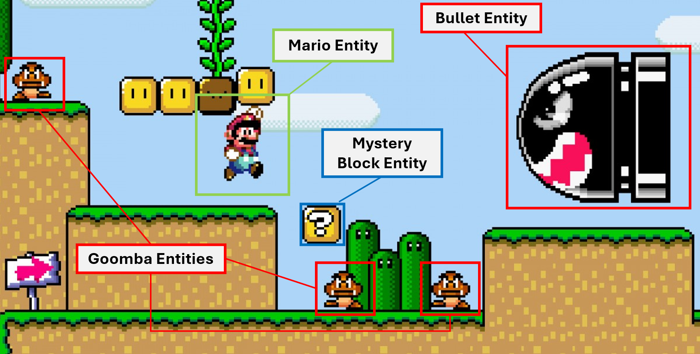
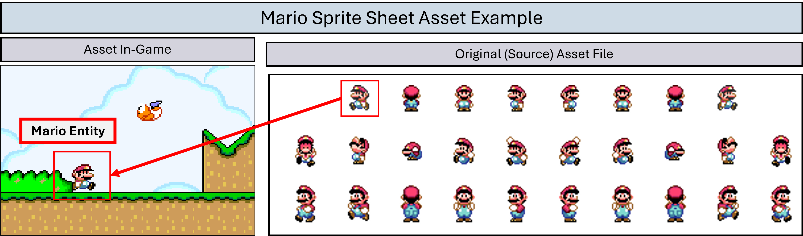

# Game Engines

Last week, we built and designed a game of Pong from scratch using Raylib. We learned the fundamentals of game programming, coordinate systems, and how to program game logic. Now, we're going to learn how to make games using **game engines.**

The primary difference between making games from scratch and from engine is that, in engines, you must learn the **systems** the <u>developers of the engine designed</u>, and how you can use those systems to design games of your own.

## What are Game Engines?

Game engines, put simply, are technical tools meant to assist developers in creating games *without* having to build everything from the ground up. As we talked about last week, many video games have common components in **graphics, audio, physics**, and **other components**.

The purpose of a game engine is to be a <u>generic solution</u> for these problems. "Generic" meaning it tries to solve the problem to work for as many developers to make their games. Obviously, it's not possible for one game engine to solve all problems for all game developers. That's why there are multiple different engines in the industry, and each one tries to solve the **common technical problems (audio, graphics, etc..)** of game development in a way that allows developers to **use that engine** to create **<u>certain types</u> of games.**

Within the constrained framework that game engines provide, developers have the freedom to use the systems provided to make their own games.

## Why Godot?

There are various popular game engines used in the industry. Arguably the biggest three are **Unity, Unreal, and Godot**. For this bootcamp we chose <u>Godot</u>, the reason why is that Godot is one of the **simplest** game engines you can learn to use **quickly**, which makes it a perfect fit for this course. **Unity and Unreal** on the other hand, are more <u>complex</u>, conversely, they take longer to learn.

## Entities

Despite the differences between these game engines, there are some things that most if not all game engines have in common. One of them is an **entity system.**

Most engines handle their <u>logic and data</u> encapsulated in units called **"Entities".** Entities — also known as **Game Objects** or **Actors** — are effectively the **building blocks** of the game. They are the **objects** that <u>populate the game world</u>, and each entity has its own **properties/data** and **logic/code**.

All entities have some shared and common properties. For example, <u>each</u> entity may have:

- A **name** and **unique ID**

- A **position** in space (Can be **2D or 3D**)

- A **place** in a general game **hierarchy** (sometimes called a tree)

- Some other properties depending on the game engine

We discussed last week the concept of the **Update** function in games. That is the code that is executed on a *per-frame* basis. When we were making Pong, we had *one* big update function to handle the logic of the entire game. In game engines, the game is still updated on a per-frame basis, however, instead of *one* update function to handle the *entire* game, there are often *multiple, smaller* update functions that handle the logic for *each entity.*

Let's take a hypothetical example from Super Mario.



Here, we have multiple entities on the screen. The point to keep in mind here is that each one of these entities have their own **state (data)** and **logic** functions for being updated that are executed each frame. If we take the Mario Entity for example:

```gdscript
var name : String # name of the entity; "Mario"
var position : Vector2 # current position in space
var velocity : Vector2 # current movement vector
var num_lives : int # number of lives left before game is over
var health : float # amount of health before life is lost
var is_on_ground : bool # standing on ground or airborne?
```

??? note "GDScript"

    From here on out, we'll be coding using GDScript, which is the scripting language for Godot.
    The examples here should apply to most engines regardless of the language.
    
    
    GDScript resembles Python in many ways. There is a page in the "Godot Resources" directory for learning GDScript which we recommend you read later.
    For now, the language is simple enough that you should be able to follow along with what's happening and what is meant by the code.

This is the total *state* or data that the Mario Entity *code* can access and modify. If we look at another hypothetical example for the the actual **code** for the entity.

```gdscript
func Update():
    # move left or right based on player input
    if is_on_ground == true:
        # handle jump if player pressed jump
    else:
        # currently in the air: apply gravity

    if colliding_with_enemy:
        # take damage
```

The `Update` function is the same as the one we know from before; it is run once each frame. The only difference is that this function is "local" to just this one entity. Every other entity similarly has its own update function and mutable state that will affect the game.

Let's move on to another example for the Mystery Block Entity. The purpose of this entity is to spawn an item whenever Mario hits it for the first time.

```gdscript
var name : String # name of the entity; "Mystery Block"
var position : Vector2 # current position in space
var was_already_hit_before : bool # whether the block was hit before or not
var item : Item # what item the block gives when hit? coin, powerup, etc..
```

Here's what its logic would look like.

```gdscript
func Update():
    if mario_hit_block: # mario hits the block
        # first time mario hitting the block
        if was_already_hit_before == false:
            was_already_hit_before = true
            item.Spawn()
```

### Update Cycle

In game engines, there are multiple entities, therefore there are multiple `Update` functions. So, what's really happening between frames? What's happening is not much different from what you might expect or already know from last week.

Taking the Mario example from earlier. There are at least 6 entities we highlighted. So, those are 6 `Update` functions, some of them are the same functions, but happen to be on different entities that have different data (for examaple, the Goombas are not all in the same place). In any case, each frame, the `Update` functions are all called in some order, then the frame is rendered to the screen, and it repeats.

***Frame 1***

- Mario `Update` is called

- Mystery Block `Update` is called

- Goomba 1 `Update` is called

- Goomba 2 `Update` is called

- Goomba 3 `Update` is called

- Bullet `Update` is called

- Each entity is rendered (drawn) to the screen

***Frame 2***

- Same as last frame

No given entity's `Update` function is called more than once in the same frame, and the entities are all updated first then rendered to the screen, then the cycle repeats.

This is how the vast majority of game engine's handle their "entities". Of course, each engine may have a different word for "entity" (*GameObject* for Unity, *Node* for Godot...) but the concept of having self-contained stateful objects that have code and exist in the game world is almost universal among the big game engines, and it's the same for all of them.

## Assets

One final topic about common game engine elements we will discuss before moving on to the next section is **assets.**

In the previous section where we made Pong, we depended entirely on just rectangles and circles for the visuals. Ideally though, our game would have more detailed and advanced digital content such as models, images, textures, sounds, etc...

These pieces of digital content that go into our game are called **assets**. Game engines come with their own way of importing assets and using them in-game.

Assets can be *tethered* or *connected* to our entities to create believable, immersive, and coherent **game worlds**. They can be set through the editor of the engine, or set and changed through code to respond to events.

Here's an example of a Mario sprite asset being used inside the Super Mario game.



As you can see, there is a general "sheet" of sprites containing many images of Mario, but in the game, we can see Mario as an entity clearly moving around and interacting with the world. In here, it's as if we've "clipped" the sprite from the sheet, and glued it onto the Mario entity in the game to give it life.

In reality, this is what happens most of the time in game engines. If the sprite didn't exist, we would not be able to see Mario at all, or we would see him just as a lifeless rectangle. The asset we *import from* the sheet *to* the *game* gives our entity life.

And with that, we conclude this section on game engines. In the next section, we will talk more about Godot and how it works.
