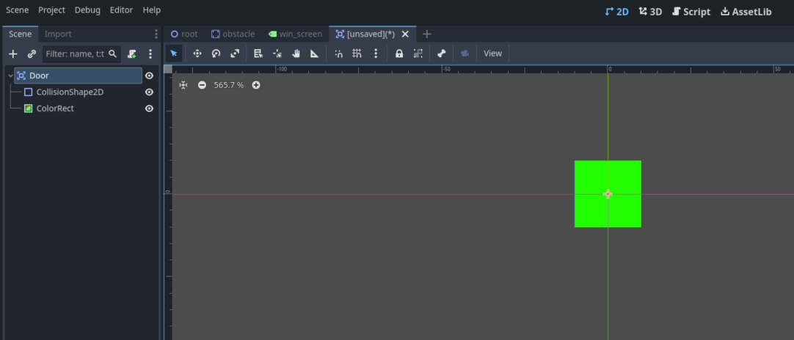
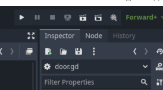
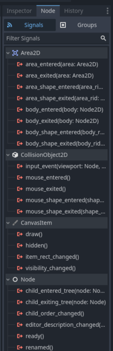

# Making a Simple Platformer

## Refactoring

Let's try and make a simple platformer, where the player can move and jump, and their goal is to reach a certain point in the level.

First, let's try and reorganize our code and input maps to be better organized. Let's use the input map feature of Godot to define certain input actions and their associated keys. We want the player to be able to move left and right, and jump.

Let's define each of these three actions.


## Player Script

Now let's rewrite our player's code.

```gdscript
@export var speed : float = 400

func _physics_process(delta : float) -> void:
    var input_direction : float = Input.get_axis("player_left", "player_right")
    velocity.x = input_direction * speed

    move_and_slide()
```

!!! note "Physics Process"

    In Godot, there are two "update" functions.
    A regular _process() function, and a specialized _physics_process() function.
    
    The regular _process() updates every frame it possibly can, it's better suited for game logic related code.
    
    The _physics_process() on the other hand, updates on a fixed timestep, which means it's scheduled to execute on a certain timescale (every 0.05 seconds, for example).
    
    The schedule will never change, not as the game is running nor across different devices.
    The _process() however is variable (changes with FPS).
    
    This makes _physics_process() better for handling physics computations, since it will make the physics outcomes our code more deterministic and less random.
    
    You can read more about the different process functions on [Godot's official documentation on the subject.](https://docs.godotengine.org/en/stable/tutorials/scripting/idle_and_physics_processing.html)

This will make our player move only left and right based on input. Let's scale the player up in our game (press the S key in the editor to switch to scale mode) and play.


Let's place the obstacle underneath the player now towards the bottom of the screen, and try to apply gravity in our code.


### Gravity

We want to apply gravity so long as the player is **not** on the ground. If we open the docs for the *CharacterBody2D* node, we can find a suite of methods for detecting which part of the node is colliding with which direction.


The one we're interested in is `is_on_floor()`, particularly, we're interested in when this methods return value is false.

We need to do a check in the script to see if this method return value is false.

```gdscript
    var input_direction : float = Input.get_axis("player_left", "player_right")
    velocity.x = input_direction * speed

    if not is_on_floor():
        # apply gravity
```

When this `is_on_floor()` is false, we know we're in the air. When we're in the air, we want to apply gravity. One way to do this is to create a simple `gravity` property in the player script and set `velocity.y` to this property when we're in the air.

```gdscript
@export var speed : float = 400
@export var gravity : float = 500

func _physics_process(delta: float) -> void:    
    var input_direction : float = Input.get_axis("player_left", "player_right")
    velocity.x = input_direction * speed

    if not is_on_floor():
        velocity.y = gravity
```

But there's a problem with this code. In the real world (and in games too), gravity is an <u>accelerant</u> to velocity. In other words, velocity is not <u>equal</u> to gravity, it is <u>accelerated</u> by gravity. The relation we've specified in the code is an <u>equal to</u> relationship `velocity.y = gravity`, if we want to be more accurate, it would be an <u>acceleration</u> relation `velocity.y += gravity`.

But there's another problem with `velocity.y += gravity`, if we're adding gravity *every frame*, that means the rate of acceleration will be variable depending on the frames per second, to decouple FPS from the acceleration we need to multiply by delta `velocity.y += gravity * delta`.

```gdscript
    if not is_on_floor():
        velocity.y += gravity * delta
```

This is a more accurate application of gravity in our script code.

If we run it now, we can see our player will move down and land on the obstacle, and continue accelerating downwards when we move off of it.

### Jumping

Now we want our player to be able to jump. The way we do this is by first checking if we *are* on the ground, and checking if we have pressed the jump button, since those are two condition we need to make sure are true when we jump.

This is pretty straightforward, we already know the function to check if we're on the floor, and the function to check if we've pressed an action is `Input.is_action_just_pressed("action")`.

When we jump, we want to set `velocity.y` to some force that goes **upwards**, and then we'll just let gravity do the rest. What will happen is the player will move upwards at a decreasing rate, until it stops at the peak and then accelerates downwards.

We'll create a variable called `jump_force` to describe what this initial `velocity.y` is upon jumping.

```gdscript
@export var jump_force : float = -400
```

Then when the conditions for jumping are fulfilled we'll set `velocity.y` equal to this jump force.

```gdscript
    if is_on_floor():
        if Input.is_action_just_pressed("player_jump"):
            velocity.y = jump_force
```

Once we run it we can see we're jumping properly now.


Now we've done most of everything related to the player script, let's try to complete the other parts of our platformer.

## Obstacle Scene

At the moment, in our scene tree, the obstacle is just another "branch" for the root node. It's not considered its *own* scene.


What we want to do is to make this branch its own scene. The reason we want to do this is so that we can get control over *every instance* of the scene.

The way we do this is by right-clicking on the node we want to make its own scene, and clicking on "Save Branch as Scene..." This will prompt us to name our scene file and place it in our file system.


I've made 2 folders, a Scripts and Scenes folder to better organize our assets. I'll place our new obstacle scene in the Scenes folder.


Once we save it we can see in our tree, in place of our old branch we just have an *Obstacle* node that we can't expand to see its children. However there is a strange film-director icon next to it. When we press it, it will take us to a new tab with just the obstacle scene by itself.


In this independent scene, our obstacle node is not centered in the origin. This is not ideal since it will make placement of our scene in another scene odd since it might not always land where we expect it to as soon as we place it in the scene.

Let's just center the scene to the origin.


Once we return to our root scene, the obstacle will be in the origin. That's fine, just change its position back. Let's copy the obstacle now and create a sort of level with obstacles. Make sure the pasted obstacles are children of root!


Let's play and test the level.


It works fine, but what if we want to change the color of the obstacles? Like orange for example.

Before saving our obstacle as a scene, we would've have had to manually change the color of each obstacle, one by one. But now that our obstacle is its own scene, all that we have to do is go to that scene and change it's color, and all of the instances of that scene in other places will change as well.


If we save and go back to our root scene, all of the obstacles will have changed colors now.


## Creating a Door to Another Scene

Having this basic platformer is good, but what if we want an end to the level? Say, a door, that once touched by the player will change the current scene to a separate scene that has the text "Congratulations, we've just made our first game in Godot!".

Let's create such a scene, in the top part of the screen, there's a "+" icon next to the tabs. Clicking on it will create a new scene.


Let's create a "Label" node as the root of this scene.


Let's adjust its properties so that it's centerd in the middle of the screen and has the text we want.


Let's save it as "win_screen.tscn" in our Scenes folder in the file system.


Now let's create the "Door" scene.

For this, we'll just make an *Area2D* node with *ColorRect* and *CollisionShape2D* children.



Let's save it as "door.tscn".


### Scripting

We'll stay in our "Door" scene tab for now, let's create the script for detecting if the player has touched the door.

For this we'll use [signals](https://docs.godotengine.org/en/stable/getting_started/step_by_step/signals.html). Which are kind of like events or announcements that an event has occurred stemming from one node. Other nodes can respond to this event in whatever they like.

When you open the documentation for a node, you can see all of the signals of that node. For *Area2D*, the event we're interested in is `body_entered`.


We'll create a script for the door node called "door.gd" (place it in the Scripts folder). Let's hook up this `body_entered` signal to our new door script.

The way we do this is by clicking on the "Node" tab next to our inspector window.



When you select a node in the scene tree, it will show you all of the signals of that node.



From here you can link a signal to a script. Let's click on *body_entered* and connect it to our Door node.


This will create a new *receiver method* in our Door script. The green arrow means the method is a receiver method, which means it will execute in *response* to a signal being emitted. In this case, this method will execute once our *Area2D* door detects a body entering the area. In other words, when our player touches it.


Now let's make it change scenes once we've touched it. The function to do this is `get_tree().change_scene_to_file("scene)`. Once you type it out, it will fill an autocorrect with all scenes in the file system.


Let's choose our new "win_screen.tscn" scene.

```gdscript
func _on_body_entered(body: Node2D) -> void:
    get_tree().change_scene_to_file("res://Scenes/win_screen.tscn")

```

Now let's finally place this new Door scene in our root. Just go back to our root scene and drag the *door.tscn* from the file system to the tree. Again make sure it's a child of root.


Now once we play, it should work.


And that's it! That's our first game made in Godot.
