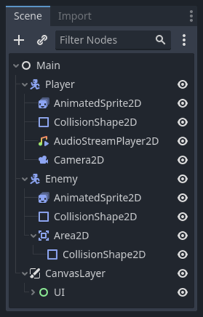
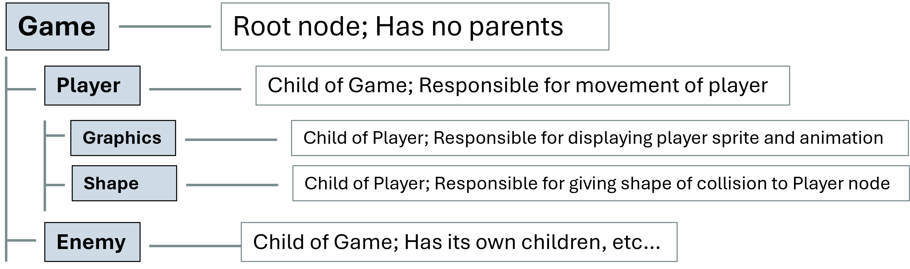

# Nodes and Scenes in Godot

## Nodes

Nodes are the **building blocks** of your game in Godot. They are kind of like entities. There are **<u>different types</u>** of nodes, and each type has its own **predefined behaviour and properties** that can be **extended** using **scripts.**

The developers of Godot describe nodes as like **ingredients** in a recipe.

All nodes have:

- A Name

- Editable Properties

- Callbacks <u>(Methods)</u> to <u>Update</u> Every Frame

- <u>Extensible</u> Properties and Functions

- Can be <u>Added</u> to Other Nodes as <u>Children</u>

## Scenes

The last of those properties — the ability to add nodes to other nodes to create children — is arguably the most important.

Nodes can be attached to each other as children to form **trees** of nodes called **scenes**. These **scenes** can all be combined with each other to form one, coherent **game**.

**Official Godot Example**

**Extended Example Tree**

You can watch this [video at this timestamp](https://youtu.be/LOhfqjmasi0?t=332) by Brackeys to learn more about how this works.

## Node Inheritance

Nodes “<u>inherit</u>” other nodes. Meaning that if a node inherits another node, all of that parent’s properties and methods will pass on to the inherited node.

Notice that with each descending node type, all of the properties and methods of the node it inherits from exists within it, in addition to some unique properties and methods.

## Node Nesting

Nodes being attached to other nodes as children will make their position relative to its parent node. "Relative" in this case means that its <u>origin point</u> is the <u>position of its parent node.</u>

Here's an example.

Node B is a **child** of Node A. It's <u>local position</u> is (0, 0). This means it's **real (<u>global</u>) position** is the same as Node A's global position.

Another example:

Here, Node B is still a child of Node A. But it's local position is (-2, 0). This means that wherever Node A is, Node B will always be (-2, 0) or <u>two units left</u> of Node A's position.

An example of where this might be useful for game development is if you have a player character carrying a weapon that has its own hitbox, you can make the weapons position relative to the player, and the weapon can move around the player in any direction you specify.

## Scripting

In addition to their predefined behaviour, nodes can have behaviour defined by **<u>scripts</u>** the developer creates to take advantage of the **capabilities** offered by a node. Each node can have **only one** script attached to it. When you create a node, it will automatically be filled out with **three things.**

Godot has built-in documentation that explains each node. You can reach this documentation by holding down <u>ctrl</u> and pressing on a node or other keyword you want to learn more about.

The documentation for Godot and its nodes is very good. When you're scripting for a node you're not familiar with or are encountering bugs from a specific node, you'll often be going to the node's documentation to see exactly what it does.
