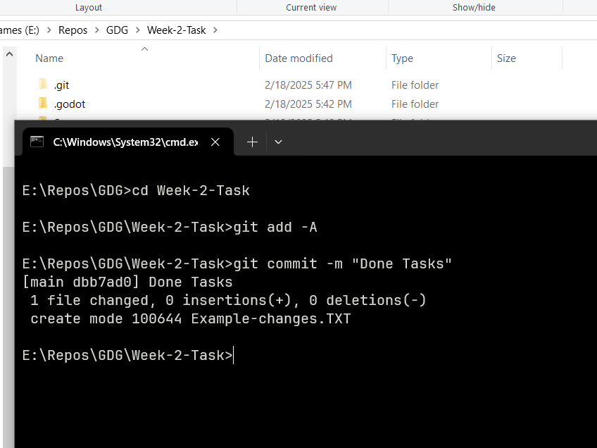
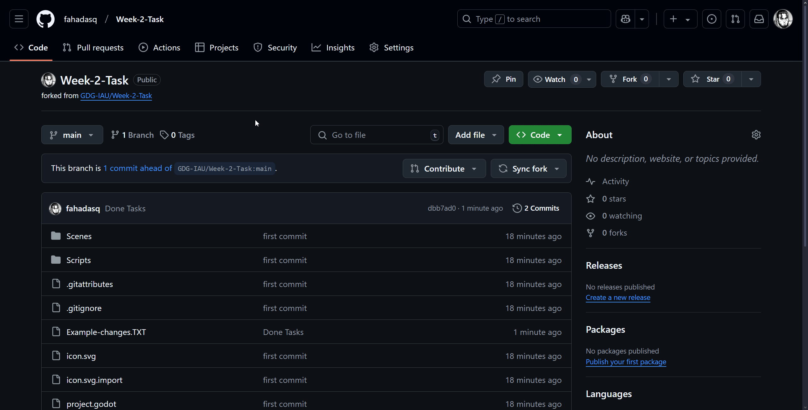

For this week, you have 3 tasks. You must build upon the work done in the workshop to make the game more sophisticated.

## Task 1: Use Collision Layers and Masks to Make "Door" *Only* Collide with the Player

In our current scene, when the door touches *anything*, it will trigger the signal and change the scene.

Your task is to use the [Collision layers and masks](https://docs.godotengine.org/en/stable/tutorials/physics/physics_introduction.html#collision-layers-and-masks) feature in Godot to **filter out** the non-player colliders from the player colliders.

### Hints

You can set-up the collision layers like this.

## Task 2: Create a "Killzone" Scene that Resets the Current Scene when the Player Touches it

Currently, if our player falls off the obstacle, he keeps falling down infinitely and the game doesn't reset it.

Your task is to create a new scene and script of type *Area2D* called "Killzone".

You should place the node underneath the level and scale it horizontally to cover as much area so that when the player falls off, he will certainly touch the killzone.

Once the player touches this "killzone" the game will reset the current scene.

### Hints

- Use the `body_entered` signal.

- The method to reload the scene: `get_tree().reload_current_scene()`

## Task 3: Make a Level 2 Scene with Obstacles and a Player, in the Door Script, Make the Scene that is Switched to When the Player Touches it Variable

Currently, when our player touches the door, we are transported to the win_screen scene. What if we wanted to make it go to a level 2 instead? And what if we want we want Level 2 to go to the win screen?

Your task is to make a level 2 scene with a player, obstacles, killzone and a door that goes to the win screen.

In the first scene, make the door instead go to this new level 2 scene.

### Hints

- The method to use instead of changing from file in `door.gd`: `get_tree().change_scene_to_packed()`

- The way to make an exported PackedScene variable in `door.gd`: `@export var next_scene : PackedScene`

## How to Submit the Task

The setup or template of the task is a [Github Repository](https://github.com/GDG-IAU/Week-2-Task). You must fork the repository, clone it to your device, work on it, push it, and then make a pull request.

### 1. Forking the Repository

Now you should have a version of this repository under your account.

### 2. Cloning the Repository and Adding it as a Project

Go to the folder where you want to work on the task.

Copy the link for your git repo.

Open the terminal for the folder where you want to work on the task.

type `git clone` and paste your repository link.

Press enter.

Now open Godot. In the project manager, click on "Import".

Choose the folder you cloned using `git clone`.

Click "select this folder". Then "Import & Edit".

Now click on "root.tscn" in the file system and begin working on the tasks. If it says there's a dependency error regarding "level_2.tscn", ignore it.

### 3. After You're Done Working on the Tasks

Go back to the terminal where the folder you cloned was. Enter into the folder in the terminal.

Enter `git add -A`.

Then `git commit -m "message"`. You can make the message whatever you want.

Finally `git push`.

## 4. Make the Pull Request

Back on your GitHub page for the repo. Click on "Pull Requests", and create a pull request. Be sure to name the PR with:

> Your Full Name - Week 2 Task

You'll know the task is submitted when you go to the Pull Requests tab of the original repo and you see your name in it.

